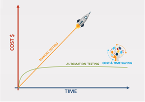
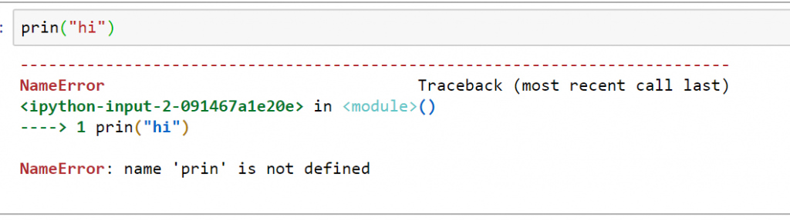
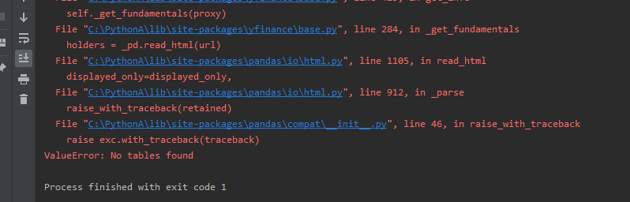
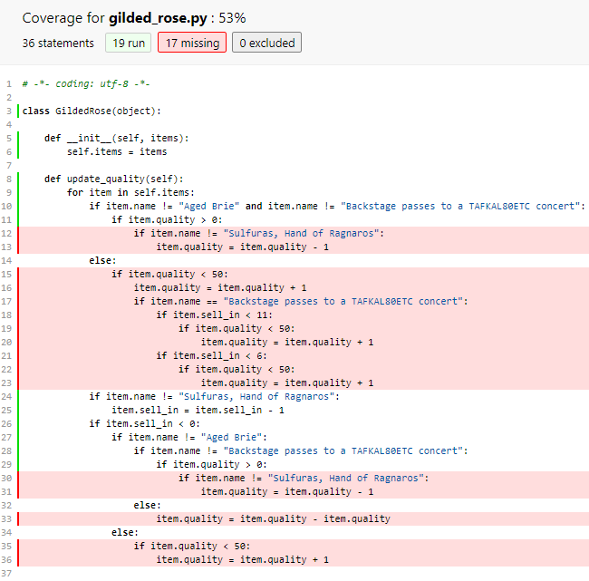
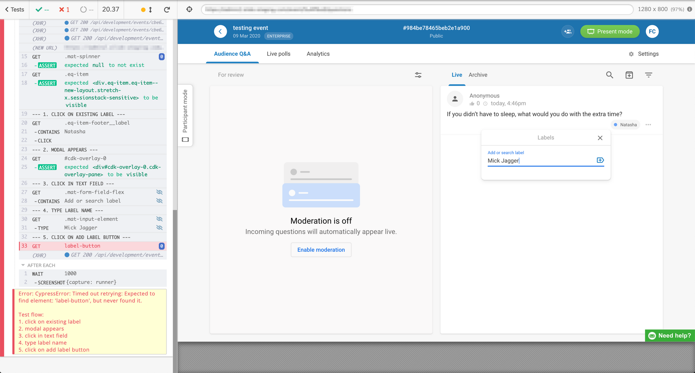

# Automated Testing and CI Pipelines

## What is the problem with manual testing?

- tedious
- some scenarious are hard to repeat
    - eg. network issues, database randomly crashes
- repetitive
- growning number of scenarios
- time consuming

???+ info "Cost Savings"
    

??? example "Scenarios that are hard to repeat - Network Requests"
    ```python
    import requests
    def make_network_request():
    try:
        response = requests.get("https://www.google.com")
        if response.status_code == 200:
            return response.text
        else:
            return None
    exception requests.exceptions.ConnectionError:
        return None
    ```

    This is the way to simulate an exception after a network request.
    ```python
    import pytest
    def test_make_network_request_exception(mocker):
        mocker.patch("requests.get", side_effect=requests.exceptions.ConnectionError)
        assert make_network_request() is None
    ```

## Importance of Software
Before you can truly understand why testing is important, we first have to understand the importance of software.

???+ examples "Importance of software in different parts"
    **Control Systems**

    

    **Healthcare**

    

    **Transportations**

    

    **Daily life**

    

    **Office Work**

    

    **Education**

    

## Software is Fragile

???+ quote
    It only takes a character difference to prevent a software from compiling or running.






## Consequences of Fault Softwares

**Huge Compute Charges**


**Embarrassment**


**Disruptions**


**User Frustations**


**Client loss**


**Death**


## Automated Testing

### What is involved manual testing usually?
To be able to automate testing, we need to understand what is involved in manual testing.

- Open your own environment and tools
- Git checkout/pull/fetch
- Install dependency
- Setup the environment
    - Do you need to clear the database?
    - Do you need to enter a couple of data?
    - Do you need to disconnect the internet while server is running?
- Perform the steps to test
- Assert the test correction?
- Did you make a mistake? (repeat the entire thing)
- Now do a different scenario!
- Hang on a sec? Your coworker forgot to push? Now do all scenarios again

### How does automated testing work?

- Write scripts to evaluate code
- Write script to run scripts when certain events happen (more so later)
- Update Scripts whenever change happens

???+ example "Example from the workshop with github actions - Software Engineering Practices"
    ```yml
    name: Python package

    on:
    pull_request:
    workflow_dispatch:
        inputs:
        logLevel:
            description: "Log level"
            required: false
            default: "warning"

    jobs:
    flake8_py3:
        name: "Linting with Flake8"
        runs-on: ubuntu-latest
        steps:
        - uses: actions/checkout@v2

        - name: "Set up Python"
            uses: actions/setup-python@v2
            with:
            python-version: 3.x

        - name: "Install flake8"
            run: pip install flake8

        - name: "Run flake8"
            uses: liskin/gh-problem-matcher-wrap@v1
            with:
            linters: flake8
            run: flake8 --max-line-length 150 .

    test:
        runs-on: ubuntu-latest
        strategy:
        matrix:
            python-version: [3.8] # you can add more python version to test it in

        steps:
        - uses: actions/checkout@v2
        - name: Set up Python ${{ matrix.python-version }}
        uses: actions/setup-python@v2
        with:
            python-version: ${{ matrix.python-version }}
        - name: Install dependencies
        run: |
            python -m pip install --upgrade pip
            if [ -f requirements.txt ]; then pip install -r requirements.txt; fi
        - name: Test with pytest
        run: |
            pytest --cov-report html --cov=.
        - uses: actions/upload-artifact@v1
        if: always()
        with:
            name: coverage-report
            path: htmlcov
    ```

### Test-Driven Development

<iframe width="100%" height="500rem"
src="https://www.youtube.com/embed/u6QfIXgjwGQ" 
frameborder="0" 
allow="accelerometer; autoplay; encrypted-media; gyroscope; picture-in-picture" 
allowfullscreen></iframe>
Define test/specification first, then write functionality. Works best if you know way ahead of time what you want.

Note: This does not always work (eg. Frontend)

???+ example "Simple Example"
    ```python
    def test_add_two_numbers():
    assert add_two_numbers(1, 2) == 3
    ```

    ```python
    def add_two_numbers(a, b):
        return a + b
    ```

???+ example "More complex example, but demonstrates how it can save time"
    Let say you have to develop a function that sends email depending on the number of users in the database
    ```python
    from django.core.mail import send_mail
    # Not guaranteed to work code
    def send_email_to_admin():
        number_of_users = User.objects.count()
        send_mail("Number of users", f"There are {number_of_users} users in the database", "no-reply@system.com",["admin@system.com"])
    ```

    ```python
    from django.core import mail
    from module import send_email_to_admin
    class EmailTest(TestCase):
        def setup():
            # Create users
            User.objects.create(username="admin" ...)

        def test_send_email_to_admin(self):
            send_email_to_admin()

            # Test that one message has been sent.
            self.assertEqual(len(mail.outbox), 1)

            self.assertEqual(mail.outbox[0].subject, "Number of users")
            self.assertTrue("1 users in the database" in mail.outbox[0].body)
            ...
    ```

    Usual workflow:

    1. Prepare your tools - mail client and smtp server
    2. Prepare your database
    3. Do manual testing + Write code (repeat)
    4. Write Automated testing

    Test Driven development workflow (also known as [red-green-refactor](https://www.redgreencode.com/about/)):

    1. Write the Automated Testing - when this is run it will fail
    2. Write code until test pass
    3. Refactor + improve code

#### GIVEN-WHEN-THEN

Acceptance of features can be divided into:
- GIVEN – what are the assumptions
- WHEN – occurence
- THEN - effect or observation

## What is CI/CD?
Scripts that runs for certain events (such as pull request, a commit) to run test or deploy

<iframe width="100%" height="500rem"
src="https://www.youtube.com/embed/scEDHsr3APg" 
frameborder="0" 
allow="accelerometer; autoplay; encrypted-media; gyroscope; picture-in-picture" 
allowfullscreen></iframe>

??? example "Providers"
    - Github Actions
    - Circle CI
    - Bitbucket Pipelines
    - Travis CI

### What's usually in CI?
- Linting (code consistency + undefined variables)
- Tests
- Builds + Deploy

Others:
- bot to auto tag issue
- Security checks
- Code Autosuggestion (kinda like linting, but it suggests stuff)

### Testing Artifacts
Files given when testing

???+ example "Coverage Report"
    

???+ example "Cypress Screenshots + Videos"
    

???+ example "Long term test reports"
    

## Demo - Cypress Integration Test / E2E Test
Cypress is a tool that simulates user interaction by programatically performing action against a browser.

Get started at [Cypress](https://docs.cypress.io/guides/getting-started/installing-cypress).