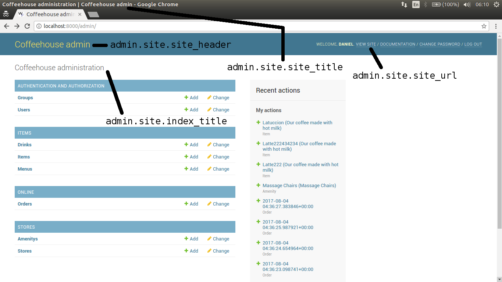

# Welcome to the Djangol!
*We've got puns 'n' data, We’ve got everything you request*


## How does an application communicate with backend systems?
**JavaScript Object Notation**

???+ example "JSON"
    [Link](https://jsonplaceholder.typicode.com/users)
    ```json
    [
    {
        "id": 1,
        "name": "Leanne Graham",
        "username": "Bret",
        "email": "Sincere@april.biz",
        "address": {
        "street": "Kulas Light",
        "suite": "Apt. 556",
        "city": "Gwenborough",
        "zipcode": "92998-3874",
        "geo": {
            "lat": "-37.3159",
            "lng": "81.1496"
        }
        },
        "phone": "1-770-736-8031 x56442",
        "website": "hildegard.org",
        "company": {
        "name": "Romaguera-Crona",
        "catchPhrase": "Multi-layered client-server neural-net",
        "bs": "harness real-time e-markets"
        }
    },
    ...
    {
        "id": 10,
        "name": "Clementina DuBuque",
        "username": "Moriah.Stanton",
        "email": "Rey.Padberg@karina.biz",
        "address": {
        "street": "Kattie Turnpike",
        "suite": "Suite 198",
        "city": "Lebsackbury",
        "zipcode": "31428-2261",
        "geo": {
            "lat": "-38.2386",
            "lng": "57.2232"
        }
        },
        "phone": "024-648-3804",
        "website": "ambrose.net",
        "company": {
        "name": "Hoeger LLC",
        "catchPhrase": "Centralized empowering task-force",
        "bs": "target end-to-end models"
        }
    }
    ]
    ```

    ???+ example "Query this endpoint using JavaScript"
    ```js
    fetch("https://jsonplaceholder.typicode.com/users")
        .then(response => response.json())
        .then(data => console.log(data))
    ```

??? info "Other ways"
    JSON is not the only way. There are things like SOAP, RPC, but nevermind them for now as you will most likely have to deal with JSON for the most parts.

## What are APIs and REST-APIs?
**Application Programming Interface**
???+ info "Analogy"
    Who interacts with the user interface? - the user
    Who interacts with the application programming interface ? - the application program (eg. the browser) 

**Representational State Transfer Application Programming Interface**

- backend architectural pattern that follows the GET/POST/PUT/PATCH/DELETE

- Can be represented in Swagger/ Open API specification

???+ info "Swagger/ Open API specification"
    

## What is Django?


**Django**

- Python web framework for creating server-side application

Follows MVC:

- Model - database
- View – Interface (API or User Interface)
- Controller – URLs + routes

See [Documentation](https://www.djangoproject.com/)

## What is Django REST Framework (DRF)?
- library for creating REST-API
- just makes it easier develop REST-API

In:

- Authentication + Permission
- Generic API Views
- Serialisers (payload validation and format)

See [Documentation](https://www.django-rest-framework.org/)


## Features of Django and DRF

### Serializers
- converter to and from Python Data types to JSON/XML
- can be used to do validation

More info [here](https://www.django-rest-framework.org/api-guide/serializers/)

### Models
**Models**

- representation of database connection or schema
Example: [Todo Django + React](https://github.com/frinzekt/React-Django-To-Do-App/blob/master/api/models.py)

#### Models with Serializers
- Model already defined the structure of the data

### Configuration file `settings.py`

**One of the most important file** - determines the app configurations and default

???+ example "Example of Items you can configure"
    - timezones
    - start of URL
    - installed Django Apps
    - middlewares
    - usually becomes the "default" configs after environment variables
    - database configuration

### Route with URLs
**Determines the URL route of the API**

- starts with the `urls.py` in the config (settings.py)

## Packaging a "Django App"
"Django Apps" are plugin system of Django. Django codebase prefers packaging each endpoint feature to a "Django App"

???+ example "Authenticate with Microsoft"
    For example: [django-saml2-auth-lw](https://pypi.org/project/django-saml2-auth-lw/) (used for Microsoft SAML SSO)

More documentation can be seen [here](https://docs.djangoproject.com/en/3.2/intro/reusable-apps/)

You can start creating your own Django app by following the steps:

1. `python manage.py startapp <app_name>`. This will bootstrap commonly used files for any "app".
2. Add the app in the `INSTALLED_APPS` in  the settings.py
3. `python manage.py makemigrations` to create the migration scripts
4. `python manage.py migrate` to run the migration script

### Views
The interface at which any application program interacts with to get something done in the backend.

???+ tip "Use DRF instead of Base Django"
    This is where it gets a little tricky. Django accomodates both frontend and backend, but where it shines is with [DRF](https://www.django-rest-framework.org/). So always refer to documentation regarding write it from the documentation.

    If you plan to use Django as an entire full-stack option, then you may not need DRF at all. Just use the [generic views](https://docs.djangoproject.com/en/4.0/topics/class-based-views/).

#### Function-based Views and Class-based Views

???+ example "Codes"
    Summary: In DRF, there's a lot more advantage to use class-based views. However, if you want the flexibility and writing things on your own, then you might want to use function-based view.
    
    ??? warning "Function-Based View"
        [Link](https://github.com/frinzekt/React-Django-To-Do-App/blob/master/api/views.py):
        ```python
        from django.shortcuts import render
        from django.http import JsonResponse

        from rest_framework.decorators import api_view
        from rest_framework.response import Response
        from .serializers import TaskSerializer

        from .models import Task

        @api_view(['GET'])
        def apiOverview(request):
            api_urls = {
                'List':'/task-list/',
                'Detail View':'/task-detail/<str:pk>/',
                'Create':'/task-create/',
                'Update':'/task-update/<str:pk>/',
                'Delete':'/task-delete/<str:pk>/',
                }

            return Response(api_urls)

        @api_view(['GET'])
        def taskList(request):
            tasks = Task.objects.all().order_by('-id')
            serializer = TaskSerializer(tasks, many=True)
            return Response(serializer.data)

        @api_view(['GET'])
        def taskDetail(request, pk):
            tasks = Task.objects.get(id=pk)
            serializer = TaskSerializer(tasks, many=False)
            return Response(serializer.data)


        @api_view(['POST'])
        def taskCreate(request):
            serializer = TaskSerializer(data=request.data)

            if serializer.is_valid():
                serializer.save()

            return Response(serializer.data)

        @api_view(['POST'])
        def taskUpdate(request, pk):
            task = Task.objects.get(id=pk)
            serializer = TaskSerializer(instance=task, data=request.data)

            if serializer.is_valid():
                serializer.save()

            return Response(serializer.data)


        @api_view(['DELETE'])
        def taskDelete(request, pk):
            task = Task.objects.get(id=pk)
            task.delete()

            return Response('Item succsesfully delete!')
        ```
    ??? success "Class-Based View"
        

## Django Admin
Django comes with a built-in user-interface for managing "Django Apps" with models.py
By default it in the path `/admin`

???+ example "Django Admin"
    

## Other Tools

### DRF Frontend for Consuming API
When you use DRF for developing API, and use the generic API views and serializers, it will automatically create this for you.

???+ example "DRF Frontend"
    

### Postman

Development tool for interacting with APIs:

- environment variables
- collection of possible endpoints
- send different JSON body

???+ info "Postman"
    

### Python Debugger (pdb)
When you run the django `python manage.py runserver`, you can add `breakpoint()` to anywhere piece of your code. This will stop the terminal line to the breakpoint if it hits it. From here you can do debugging.

## Demo - Live Coding
Demonstrate how to create a backend for a Todo app.

1. Setup Python environment `python -m venv venv` then activate with `source venv/bin/activate`
2. Install Django `pip install Django`
3. Setup django codebase `django-admin startproject todo`
4. [Install DRF](https://www.django-rest-framework.org/#installation)
```
# As per https://www.django-rest-framework.org/#installation
pip install djangorestframework
pip install markdown       # Markdown support for the browsable API.
pip install django-filter  # Filtering support
pip install pytz           # Timezone support
```

5. Freeze requirements `pip freeze > requirements.txt`
6. Do a python sqlite migration `python manage.py migrate` to initialise the Django database for the apps
7. Create a super user `python manage.py createsuperuser`
8. Run the django app with `python manage.py runserver`
9. Login with the super user and show Django Admin
10. Setup django app `python manage.py startapp api`
11. Create a model `models.py`
```python
from django.db import models

# Todo Model
class Todo(models.Model):
    title = models.CharField(max_length=100, )
    description = models.TextField()
    completed = models.BooleanField(default=False)
    created_at = models.DateTimeField(auto_now_add=True)
    updated_at = models.DateTimeField(auto_now=True)

    def __str__(self):
        return self.title
```

11. Do a python sqlite migration `python manage.py makemigrations` and `python manage.py migrate`
12. Show sqlite
13. Create serialiser `serializers.py`
```
from api.models import Todo
from rest_framework import serializers

class TodoSerializer(serializers.ModelSerializer):
    """
    Serializer for Todo model
    """
    class Meta:
        model = Todo
        # All fields
        fields = '__all__'
```

14.  Create Class-based view `views.py` and link back to the `urls.py`

???+ info "Most concise way of doing this"
    ```python
    # api/views.py
    from django.shortcuts import render
    from rest_framework import viewsets, permissions
    from api.serializers import TodoSerializer
    from api.models import Todo

    # Class Model Viewset
    class TodoModelViewSet(viewsets.ModelViewSet):
        # Define the serializer class
        serializer_class = TodoSerializer
        # Define the queryset
        queryset = Todo.objects.all()

        # Permissions (left to your own exercise)
        # permission_classes = [permissions.IsAuthenticated]

        # Define the list of allowed HTTP methods (by default if you didn't define it, it will just enable all)
        http_method_names = ['get', 'post', 'put', 'patch', 'delete', 'head', 'options', 'trace']
    ```

    ```python
    # api/urls.py
    from django.urls import path, include
    from rest_framework import routers
    from api.views import TodoModelViewSet

    router = routers.DefaultRouter(trailing_slash=False)
    router.register(r'todos', TodoModelViewSet)

    urlpatterns = [
        path('', include(router.urls)),
    ]
    ```

    ```python
    # urls.py
    from django.contrib import admin
    from django.urls import path, include

    urlpatterns = [
        path('admin/', admin.site.urls),
        path('api-auth/', include('rest_framework.urls')),
        path('api/', include('api.urls')),
    ]
    ```

15. Manually test with DRF Frontend or postman

