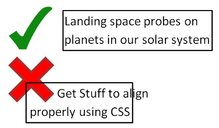
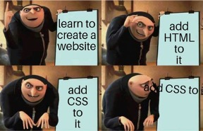
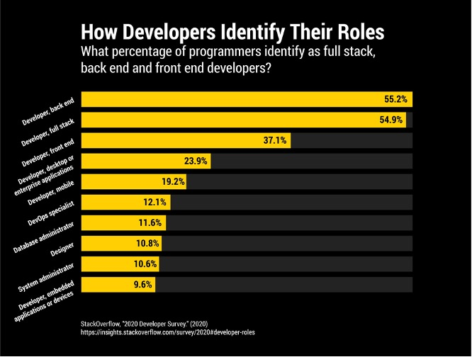
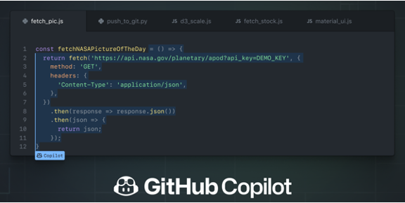
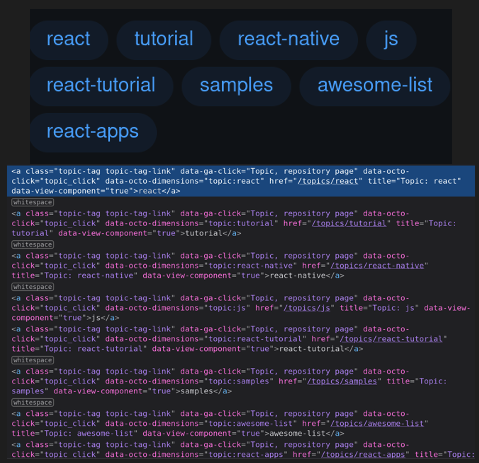
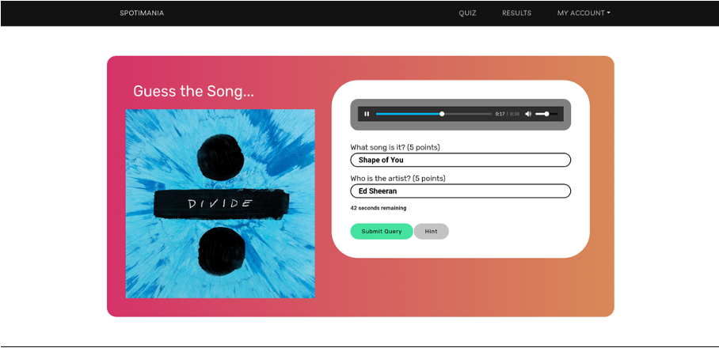
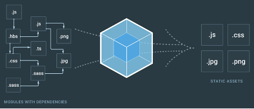
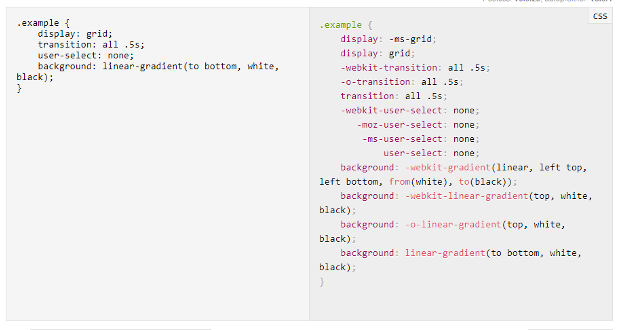
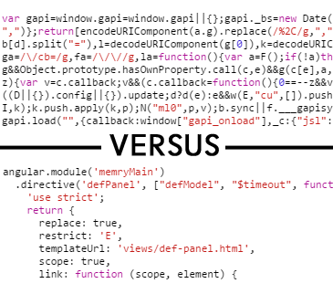
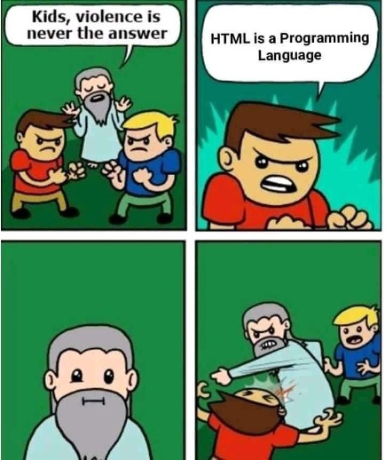

# Introduction to Frontend Frameworks
*An intuitive explanation of why frontend frameworks are used*

## Frontend Engineering

- Frontend Engineering, one of the most important aspect of web dev
- Feared by lots of developers (ehem ehem CSS)

??? info "Memes"
    
    
    
    

## Job Market and Trends

???+ info "StackOverflow 2020"
    Can be seen that there is a huge portion that will needs frontend.

    Note: Developers can identify as many types

    

???+ info "Startups"
    
    

### Github Copilot and Drag and Drops
- Getting replaced by AIs, Drag and drops?
- Far from reality?

???+ examples "Github Copilot and Squarespace"
    
    

## Problems 

### Cross-Browser Support
- Need to support multiple browsers

### HTML is WET!
Not DRY = WET

D – Don't

R – Repeat

Y - Yourself

???+ example "Github Tags System"
    

### Inefficiencies of Reloading
- Most parts of website don't change

???+ example "Youtube"
    

- What about with notifications and realtime updates?

???+ example "notifications"
    

### State Management and Rerendering
- How do you handle changes in the state of the application?

#### Example "Spotimania"
Realtime Multiplayer Song Guessing Game
https://spotimania.herokuapp.com/



Information

- Song picture
- Notifications when someone joined or scored
- Song title + artist

How do we handle when we "Submit Guess"?

???+ info "HTML Format Submit Approach"
    1. Reloads = loses current state
    2. How do you coordinate with players?

???+ info "AJAX Calls"
    1. From frontend, use JS to do AJAX Calls
    2. After receiving AJAX call, modify everything that needs the data (Find element by DOM, do some janky HTML inject)

    ```js
    const newData = await fetch(…)
    const image = document.querySelector('img .music')
    image.outerText = ``
    ```

    ??? bug "Cross-site Scripting"
        Now, you have to implement your own strategy to do this.
        ```js
        newData = {… , image: "<script>hack()</script>", ...}
        ```
        

    ???+ note "  When you try to do render by that approach:"

       - slower (rerendering things that should not render)
       - tedious (find element and update)
       - security
       - code complexity
       - hard to keep track of states (especially if different portion of the UI relies on a certain data)

## How do we fix it?

### Cross-Browser Support

**Babel: Transpiles / Translates**
New JavaScript to old JavaScript that is supported


**Webpack: Bundles / Packs**
Bundles the JavaScript modules into a single minified file



??? example "SCSS Compilation"
    Translates concise and programatic version of CSS to something that can be understood by the browser

    

??? example "Minification"
    Makes files smaller by removing unnecessary characters

    


### What if HTML is NOT WET? What if HTML is a programming language?

??? note "Memes about HTML as a programming language"
    
    


**What if HTML has variables?**

- perform computations to be displayed in the interface (solves **State Management and Rerendering**)

**What if HTML has loops?**

- Eliminate repetitive code (solves **wet HTML**)

**What if HTML has functions?**

- Divide interface into modular components (solves **wet HTML**)
    - load only components that are not loaded (solves **Inefficiencies of Reloading**)
- interface determined by parameters
- Maybe we can write a function that will automatically update HTML when data changes? (solves **State Management and Rerendering**)

**What if HTML has condition?**

- Conditional rendering (solves Reloading to show different view)

## What's next?
The next two workshop content are:

- React
- Vue