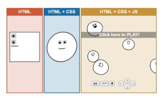

# Introduction to the Web Basics - HTML, CSS & JavaScript
*The tools of the web*

This workshop will introduce you to the basics of HTML, CSS and JavaScript, the fundamental technologies of web development. This is a very introductory workshop, and there is still so much we can learn, but this will be a good place to start.

## Content
  - [Key Web Technologies](#key-web-technologies)
  - [HTML](#html)
    - [Elements](#elements)
    - [Attributes](#attributes)
    - [Images](#images)
    - [Anchors/Hyperlinks](#anchors-and-hyperlinks)
    - [Forms](#forms)
  - [CSS](#css)
  - [JavaScript](#javascript)

## Key Web Technologies
HTML, CSS and JavaScript each have a different job when it comes to creating web pages.

### What do they do?
- [HTML](#html): describes the content and structure of the web page
- [CSS](#css): describes the style and appearance of the web page
- [JavaScript](#javascript): provides funtionality to a web page
  


## HTML
Hyper Text Markup Language (HTML) is used to structure the webpage. The general structure of a webpage can be seen below.

???+ example "My First HTML Page"
    ```html
    <!DOCTYPE html>
    <html lang="en">
        <head>
            <title>You see this text on your browser tab!!!</title>
        </head>
        <body>
            <!-- this is where the content goes! -->
            <h1>My First Heading</h1>
            <p>This is a paragraph</p>
        </body>
    </html>
    ```

### Elements
A webpage is made of elements, each with their own properties, that contain content to be displayed on the page. Elements are defined by tags, such as `h1`, `div` and `body`. Most elements have an open and close tab. The container and its content, together, are called an element.  
```html
<h1>This is a header element.</h1>
```
  
The most notable, and probably the tag you will use most, the the `<div>` tag. It defines a division or section within the HTML document, and is used as a container that holds other elements.
???+ example "The Seperator"
    ```html
    <!DOCTYPE html>
    <html lang="en">
        <head>
            <title>The Web Dev Fairytale</title>
        </head>
        <body>
            <div>
                <!-- This div concerns itself with the main heading/title of the story -->
                <h1>The Dev, the Debugger and the Caffiene Addiction</h1>
            </div>
            <div>
                <!-- This div concerns itself with the first chapter it its entirety -->
                <h1>Chapter 1</h1>
                <div>
                    <!-- This div concerns itself with the text of the first chapter -->
                    <!-- section within a section. A subsection! -->
                    <p>Once upon a time, in a castle far, far away...</p>
                </div>
            </div>
            <div>
                <h2>Chapter 2</h2>
            </div>
        </body>
    </html>
    ```

We will go through the important ones during this workshop, but you can find the full of them <a href="https://developer.mozilla.org/en-US/docs/Web/HTML/Element" target="_blank">here</a>.  
  
  
### Attributes
Most tags have attributes that specify information or change the tag. The most common being `class` and `id`.  

#### Most Common Attributes
- `class`: used to specify one or more class names for a HTML element.
    - Classes are used to group certain elements in order to give them specific features through CSS and to allow many elements to be manipulated using JavaScript. 
- `id`: used to specify a unique id for an element and must be unique
    - The `id` attribute is assigned to an element so that element can be exclusively specified in the style declaration and JavaScript manipulation
  
Below is an example of how attributes are assigned in your code.
???+ example "Elements and their Attributes"
    ```html
    <!DOCTYPE html>
    <html lang="en">
        <head>
            <title>You see this text on your browser tab!!!</title>
        </head>
        <body style="background-color: red">
            <div class="bigSection">
                <h1>BIG HEADER!</h1>
                <p id="first">This is the first paragraph of the webpage</p>
                <!-- more cool stuff goes here -->
            </div>
            <div class="smallSection">
                <h6>small header</h6>
            </div>
        </body>
    </html>
    ```
  
### Images
Images are added by using the `` element tag. Can also be used to add gifs!
???+ example Adding an image in HTML
    ```html
    
    ```

Cute, right?
  
#### Image Attributes
- `src`: specifies the location of the image to be displayed
    - This can either be a url, as in the example above, or the relative path of an image within the site's directory
- `alt`: an optional attribute that contains a text description.
    - Is useful for accessibility or if the image does not load properly 
  
### Anchors and Hyperlinks
We can add links to other websites, or even to sections within the same page, using the `<a>` element, known as an anchor.
???+ example "Adding a hyperlink to an HTML page"
    ```html
    <a href="https://codersforcauses.org/" target="_blank">Coders for Causes</a>
    ```
They can be adding added by themself, or within text such as <a href="https://codersforcauses.org/" target="_blank">here</a>.
  
#### Anchor Attributes
- `href`: specifies the destination to link to
    - External site: simply include the url you wish to visit
    - Different page within the site: include the path to the new page, usually in the form of `"/.../index.html"`
    - Different section on same page: use `#name_of_section` where `name_of_section` is the `id` of the element you wish to go to
- `target`: specifies where to open the link
    - Setting the target attribute to `"_blank"` opens the link in another tab
- `download`: specifies that the linked resouces will be downloaded.
    - Only needs to be included in the declaration of the element
    - Optional: if value of download is set, that value will be the name of the file
  
Always be careul when clicking links. Never know when there is something you <a href="/images/../2021-2022-summer/images/bon.jpg" download="bon">should not click.</a>
  
#### Images and Hyperlinks
Any image, or any element in general, can be turned into a link by enclosing the element within the anchor tabs.
???+ example "Hyperlinked image"
    ```html
    <a href="https://codersforcauses.org/" target="_blank">
        
    </a>
    ```
<a href="https://codersforcauses.org/" target="_blank">
    
</a>
  
### Forms
Forms are used to collect user input. They are defined by the `<form>` tags and usually contain form elements such as `<input>`, `<textbox>`, etc.  

Inputs can come in many different forms, such as textboxes, radio buttons, checkboxes and drop down menus. Each input field is given a `value`  
Once a form is complete and filled out, we need to submit, or POST, it. This can be done through a special input of type `submit`.  

The only required attribute of `<form>` is `action`. The `action` attribute speicifies the URL of the application that is to be called when the Submit button is pressed. If no action, then the attribute takes the value of an empty string and the current page is the destination.
  
???+example Forms
    ```html
    <p>I like:</p>
    <form>
        <input type=”radio” value=”Red”>
        <input type=”radio” value=”Green”>
        <input type=”radio” value=”Blue”>
        <input type=”submit” value=”Submit”>
    </form>
    ```
  
#### Input Validation
Input validation is a very important aspect to consider when dealing with forms. Remember the famous acronym GIGO, Garbage-in Garbage-Out.  
To assist you with input validation, HTML forms have in-built validation for different types of data, such as emails, numbers and dates. This can be achieved by changing the input type of a field to the respective data entry type.
???+ example "Baseline input validation with HTML"
    ```html
    <input type="email" name="email" value="Email">
    ```
  
  


    


## CSS
Cascading Style Sheets

## JavaScript
Also known as JS.
