# MVC-MVMM Architecture and Communications
*Separate the concerns with Design Patterns!*

## What is MVC/MVVM Architecture?

**MVC (Model-View-Controller)**

- Model – data representation layer (how app communicates to db – Raw or ORM)
- View – interface representation (with HTML, CSS and JS)
- Controller – request relays (processes HTTP requests)

???+ info "MVC"
    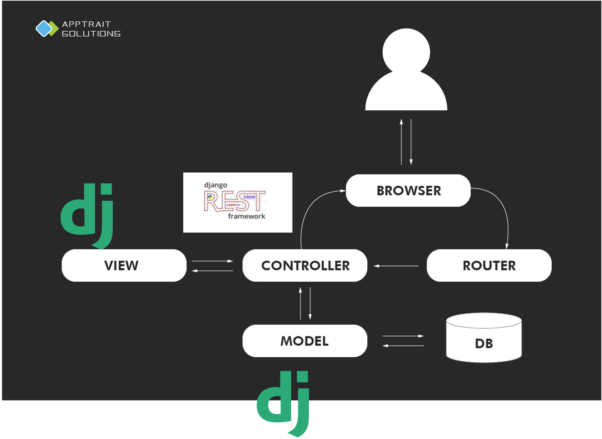

**MVVM (Model-ViewModel-View)**

ViewModel – data-binding relays (processes the HTTP requests)

???+ info "MVVM"
    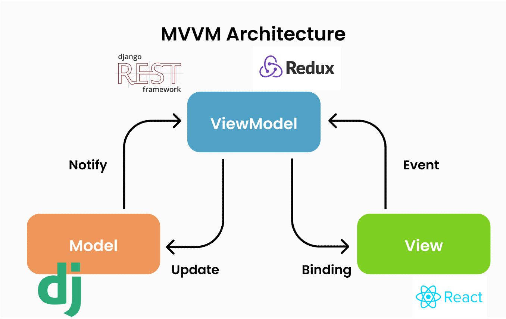

???+ warning "Some inaccuracy"
    I acknowledge that this may not be correct. If you search MVC/MVMM, you will see lots of conflicting details. This portion of the slide is explained to make frontend-backend integration easier to explain.

### Examples of Technologies with the Architecture

???+ example "MVC - Django"
    

???+ example "MVVM - Django + React"
    

???+ example "MVC - Flask"
    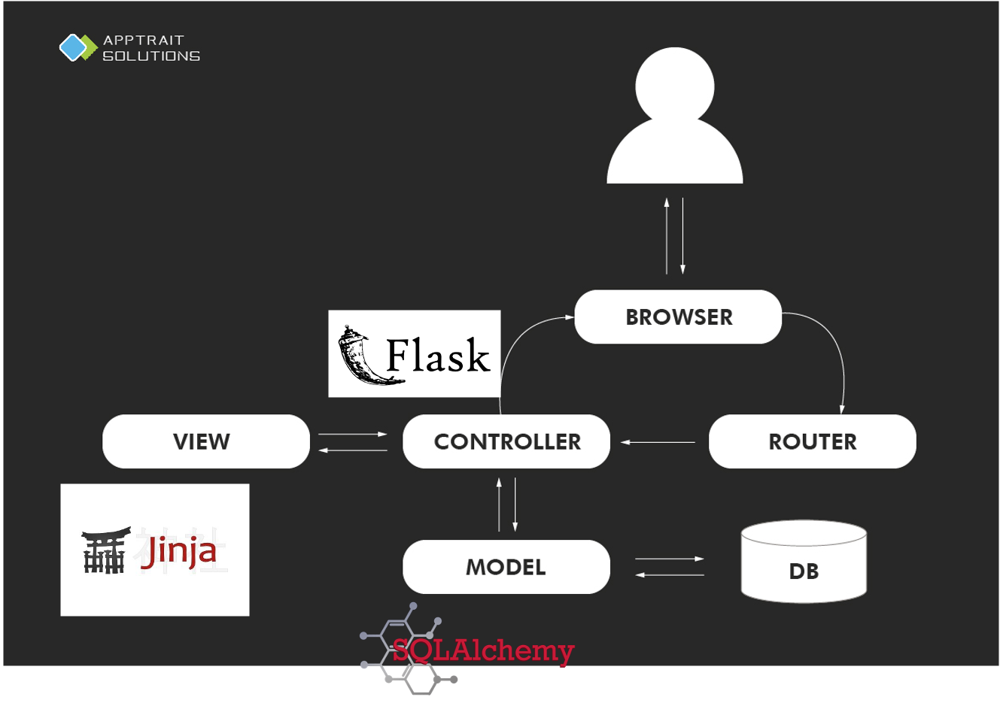

???+ example "MVVM - Flask + React"
    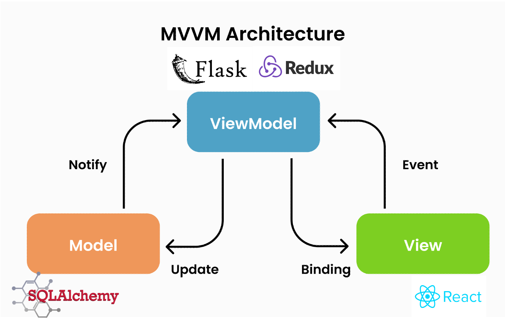

???+ example "MVC - Express"
    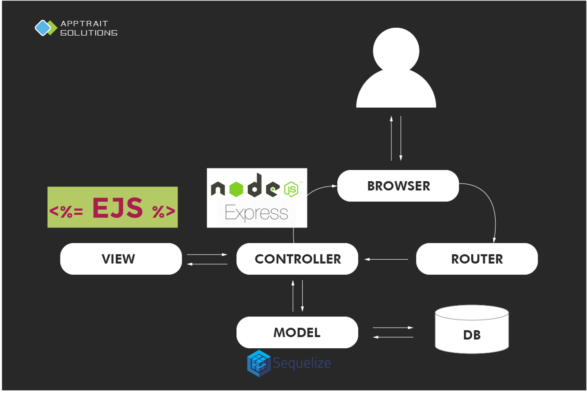

???+ example "MVVM - Express + React"
    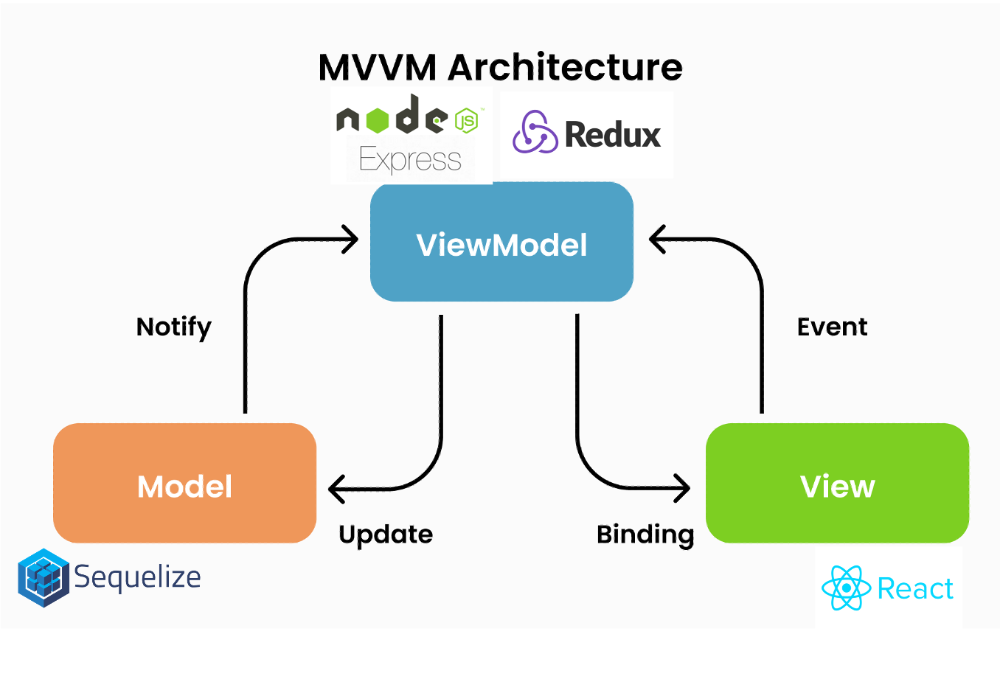

## Why is software architecture important?
Architecture shows how an entire software works in a high-level.

**Important for:**

- maintainability and extensibility
- seperation of concerns
- choosing different pieces of the stack

???+ info "Just some architecture diagrams"
    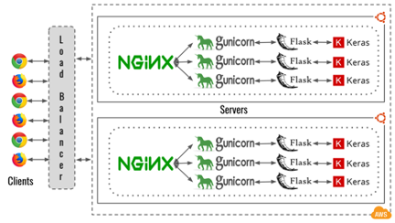
    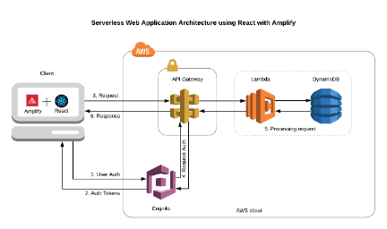
    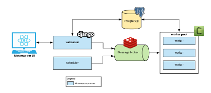

## How do frontend communicate with backend?
Via HTTP Requests responds with:

- HTML, CSS, JS
- JSON/XML

### Server-side Rendering
Via - HTML, CSS, JS

???+ info "Data Flow"
    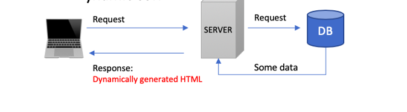

### Client-side Rendering and AJAX

Via HTTP Requests responds with:
- blank HTML with JS (at first)
- JSON/XML

???+ info "Data Flow"
    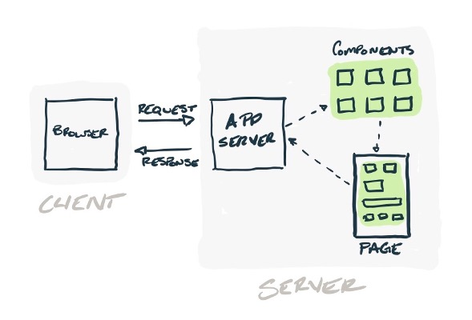

???+ info "CRUD to HTTP Verb Matching for JSON standard communications with REST-APIs"
    Matches HTTP verbs with action

    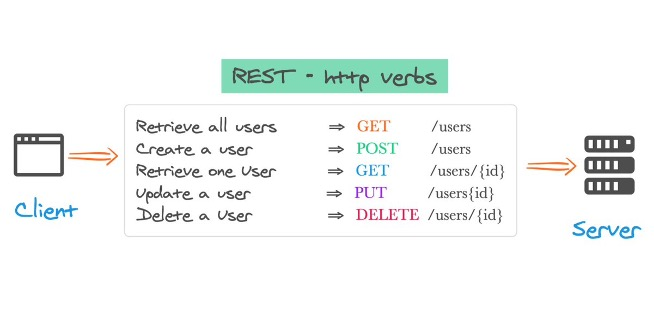

AJAX – Asynchronous JavaScript and ~~XML~~ JSON

???+ note "JSON are strings"
    JSON (JavaScript Object Notation)
    Note: JSONs are String... you have to serialise JSON to become an object

    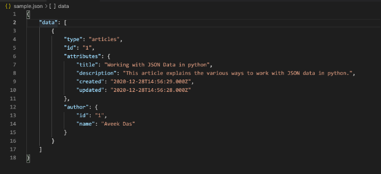

## Demo - React to integrate with Django
This follows up the demo with React to consume a standard REST-API Django Todo App demonstrated in the [previous workshop](https://workshops.codersforcauses.org/2021-2022-summer/introduction-to-backend-development-with-django/).

## Other Information
- [Traversy Media MVC ](https://www.youtube.com/watch?v=pCvZtjoRq1I)
- [React Query ](https://www.youtube.com/watch?v=46vKqPlTW2w)
- [Axios (a better Fetch?) Travery Media](https://www.youtube.com/watch?v=6LyagkoRWYA)
- [Async/Await JavaScript ](https://www.youtube.com/watch?v=vn3tm0quoqE)

