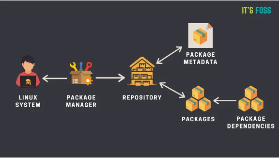
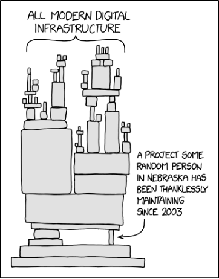
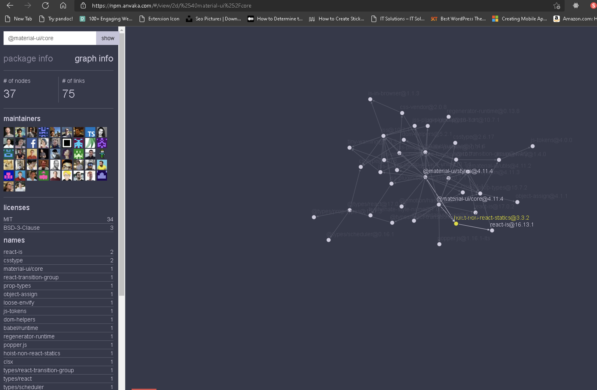
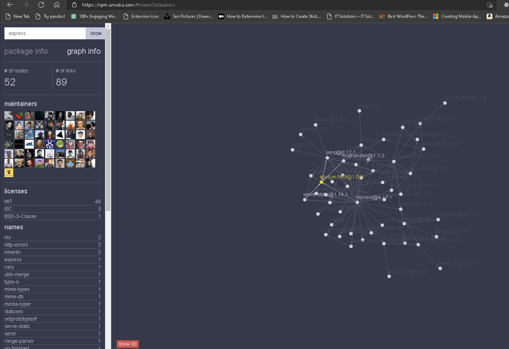
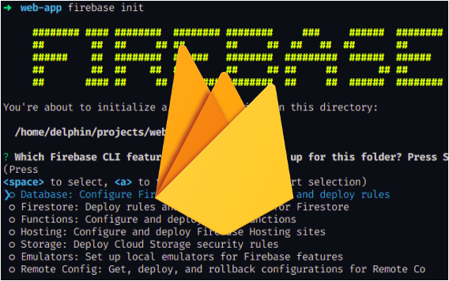

# Package Managers
*Unlock the power of open source*

## What are package managers?
- Developer tools that allows access to libraries

???+ examples
    - JavaScript (NPM/Yarn)
    - Python(Pip/Poetry)

???+ info "Diagram of the Package Manager Data Flow"
    

???+ info "Modern Infrastructure Dependency"
    

### Examples of Actual Libraries and their dependencies
See this [tool](https://npm.anvaka.com/) to visualise dependency.

???+ example "MUI Dependency"
    

???+ example "Express Dependency"
    

## Install Package Managers

- NPM Download | [Node.js (nodejs.org)](https://nodejs.org/en/download/)
- Yarn Installation | [Yarn (yarnpkg.com)](https://classic.yarnpkg.com/en/docs/install/#windows-stable)

- Pip Download Python | [Python.org](https://www.python.org/downloads/)
- Poetry Poetry - [Python dependency management and packaging made easy (python-poetry.org) ](https://python-poetry.org/)

### Actual Examples of Real-World Projects and their dependencies

???+ example "Foodbank `package.json`"
    ```js
    {
        "name": "foodbank", // (1)
        "version": "0.1.0",
        "private": true,
        "browserslist": [
            ">0.3%",
            "not ie 11",
            "not dead",
            "not op_mini all"
        ],
        "repository": {
            "type": "git",
            "url": "git+https://github.com/codersforcauses/foodbank.git"
        },
        "author": "Coders for Causes",
        "license": "MIT",
        "bugs": {
            "url": "https://github.com/codersforcauses/foodbank/issues"
        },
        "homepage": "https://github.com/codersforcauses/foodbank#readme",
        "scripts": { // (2)
            "dev": "next dev",
            "build": "next build",
            "start": "next start",
            "lint": "next lint",
            "prepare": "husky install"
        },
        "dependencies": { // (3)
            "@headlessui/react": "1.4.2",
            "critters": "0.0.15",
            "keen-slider": "6.0.5",
            "next": "12.0.4",
            "react": "17.0.2",
            "react-dom": "17.0.2",
            "react-hook-form": "7.20.5"
        },
        "devDependencies": { // (4)
            "@types/react": "17.0.37",
            "autoprefixer": "10.4.0",
            "eslint": "7.29.0",
            "eslint-config-next": "12.0.4",
            "eslint-config-prettier": "8.3.0",
            "eslint-plugin-jsx-a11y": "6.5.1",
            "eslint-plugin-prettier": "4.0.0",
            "husky": "7.0.4",
            "postcss": "8.4.4",
            "prettier": "2.5.0",
            "tailwindcss": "2.2.19",
            "typescript": "4.5.2"
        }
    }
    ```

    1.  Package Headers and Meta Information (line 2-20)

        Contains some meta information about the project. Eg. used for publication in [npmjs.org](https://www.npmjs.com/)

    2. Scripts

        Alias of commands to run using the modules in the dependency
        ```
        yarn start // yarn [script-name]
        ```

        or

        ```
        npm run start // npm run [script-name]
        ```
    
    3. Dependencies

        Libraries that are used in the project

        To add a dependency, run
        ```
        yarn add formik // yarn add [library-name]
        ```

        or 

        ```
        npm install formik // npm install [library-name]
        ```

    4. Dev-Dependencies

        Libraries that are used in the project on development environments
        Typically: linters, and testers

        ```
        yarn add -D prettier // yarn add -D [library-name]
        ```

        or

        ```
        npm install -D prettier // npm install -D [library-name]
        ```

## Lockfiles
It locks the dependencies and sub dependencies (dependency of dependency) of your application the last time it installed correctly.

Files:
- `package-lock.json`
- `Yarn-lock.json`
- `Poetry.lock`

[E.g. wais/yarn.lock at main · codersforcauses/wais (github.com)](https://github.com/codersforcauses/wais/blob/main/client/yarn.lock)

## When to install globally?
Whenever installing package, it is recommended to install it for a specific project
The only thing you should really install globally are CLI tools. Even then, you have npx

```
yarn global add [dependency]
```
or
```
npm install –g [dependency]
```

???+ example "Firebase CLI"
    

    ```
    npm install -g firebase-tools
    ```

## Demo - Material UI

1. Create a react-app `npx create-react-app mui-demo`
2. Move directory `cd mui-demo`
3. Install react-spring `yarn add @mui/material @mui/icons-material`
4. Start the app `yarn start`
5. Show [Bottom Navigation](https://mui.com/components/bottom-navigation/#bottom-navigation-with-no-label)
```js
import * as React from 'react';
import BottomNavigation from '@mui/material/BottomNavigation';
import BottomNavigationAction from '@mui/material/BottomNavigationAction';
import FolderIcon from '@mui/icons-material/Folder';
import RestoreIcon from '@mui/icons-material/Restore';
import FavoriteIcon from '@mui/icons-material/Favorite';
import LocationOnIcon from '@mui/icons-material/LocationOn';

export default function LabelBottomNavigation() {
  const [value, setValue] = React.useState('recents');

  const handleChange = (event, newValue) => {
    setValue(newValue);
  };

  return (
    <BottomNavigation sx={{ width: 500 }} value={value} onChange={handleChange}>
      <BottomNavigationAction
        label="Recents"
        value="recents"
        icon={<RestoreIcon />}
      />
      <BottomNavigationAction
        label="Favorites"
        value="favorites"
        icon={<FavoriteIcon />}
      />
      <BottomNavigationAction
        label="Nearby"
        value="nearby"
        icon={<LocationOnIcon />}
      />
      <BottomNavigationAction label="Folder" value="folder" icon={<FolderIcon />} />
    </BottomNavigation>
  );
}
```
