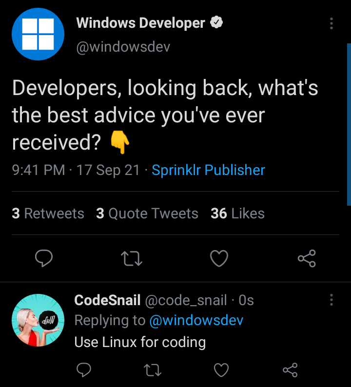

# Setup
This contains everything you need to know about getting setup.

## Coders for Causes Project Team

The following access you will need to have when working on the project

- [Coders for Causes Official Project Organisation](https://github.com/codersforcauses)
    - This includes the project repositories and CFC related long-term materials
- [Coders for Causes Learning Organisation](https://github.com/CodersforLearning)
    - This includes the templates for learning as well as the demo workshops
- Discord Channel for Project and exclusive Workshops

## Developer Tools

These are the following tools that you need:

- Code Editor: VS Code
- Version Control: [Git](https://git-scm.com/downloads)
- Interpreter: [Nodejs](https://nodejs.org/en/download/)
- Custom Package Manager: Yarn
- Interpreter (for WAIS): [Python](https://www.python.org/downloads/)
- Containerisation (for WAIS): [Docker](https://docs.docker.com/get-docker/)

???+ example "Optional Tools"
    These are tools that you may like to use, but are not required:

    - GUI for Git: Gitkraken / GitHub Desktop

After these installation, seek at the OS-specific tools.

### Windows
These are tools specifically for Windows:

- Virtual Machine: Vbox
    - You need this if you have some trouble with windows

??? warning "Warning for Windows Users"
    Legit, among all the OS, you will have the most frustrating time as a developer in windows (unless you're doing C#)
    

??? tip "Wanna have a better developer experience"
    You have a couple of options:

    - Using WSL
    - Dual Booting
    - Virtual Machines

    The recommended OS to try is Ubuntu-based Linux. My personal favourite is PopOS.
    

### Linux

These are installation specific to Linux:

- Docker Post Install
    - Lots of user forget this [documentation](https://docs.docker.com/engine/install/linux-postinstall/)

