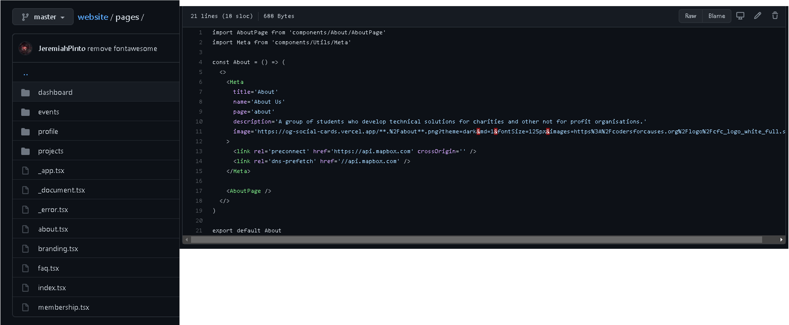
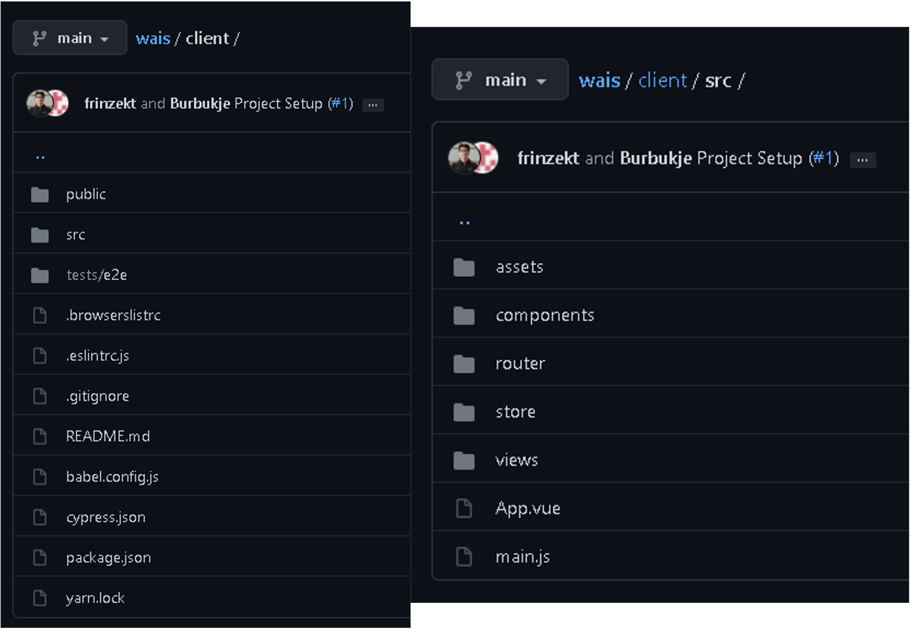
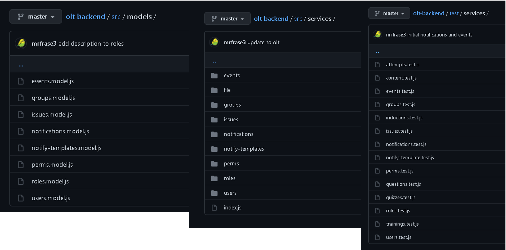
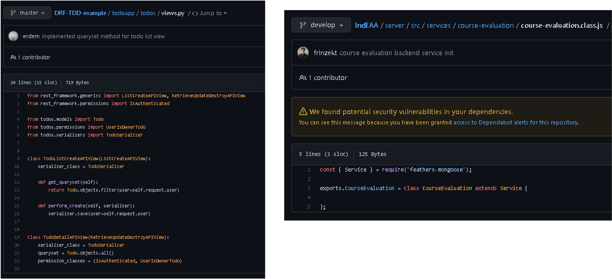

# Typical Codebase Structure
*Codebase Jigsaw: How it all fits together!*

???+ info 
    This presentation is only intended to be a brief overview of the typical codebase structure

    If you want more information about anything mentioned feel free to reach out to CFC committee and project helpers!

## Overview and Importance

- Most codebase will follow almost the same pattern (if they change, it will only change with little quirks)
- Structure helps every software engineer understand codebase and where to put it certain codes 
(better code readability = better collaboration = better profit!)

???+ info "Profit"
    

## Frontend
Example: [About Us - Coders for Causes Website](https://codersforcauses.org/about)

### Different Folders and Purpose

#### Components
Components are individual parts/pieces of user interfaces

#### Pages
Pages are the direct components that are related specific to a route or URL

#### Public / Assets
Assets are usually elements that are referenced E.g. Images, Videos

#### Utilities / Helpers
Pieces of code that are used as utilities or helpers to other codes

#### Tests
- Scripts that tests that code works
- Usually E2E frontend

### Comparison with Two Codebases
Slight difference, look at software documentation or ask other engineers

## Backend

???+ note "Context - Role and Subject"
    In these example, when I mean "role", I mean the general role of file. "subject" means the feature or group functionality

### Method of Organisation

#### Subject-Oriented Driven Structure
As it can be seen here, both **different folders** will have the **same filenames based on its role**. App grows, those files can itself become folders as well.

Example: [erdem/DRF-TDD-example: An example Django REST framework project for test driven development. (github.com)](https://github.com/erdem/DRF-TDD-example)

#### Role-Oriented Driven Structure
As it can be seen here, both **both different folders** will have the same **filenames based on its subject**

Example: [our-lab-training/olt-backend: Our Lab Training - Feathers Backend (github.com)](https://github.com/our-lab-training/olt-backend)

### Different Folders and Purpose

#### Models / Database Connection
Object-Relational Model (ORM). Links the database into your app into objects

#### Routing
Determines the rules for the URL pattern 

#### Views
- In REST API, Views are your main “view” of the API

#### Tests
- Contains unit testing (+ possibly e2e testing)
- Most common candidate for transitioning from file to a folder containing more files

## Other Resources
- [Writing your first Django app, part 1 | Django documentation | Django (djangoproject.com)](https://docs.djangoproject.com/en/3.2/intro/tutorial01/)
- [File Structure – React (reactjs.org)](https://reactjs.org/docs/faq-structure.html)
- [Best practice for Django project working directory structure - Stack Overflow](https://stackoverflow.com/questions/22841764/best-practice-for-django-project-working-directory-structure)
