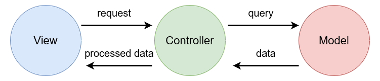
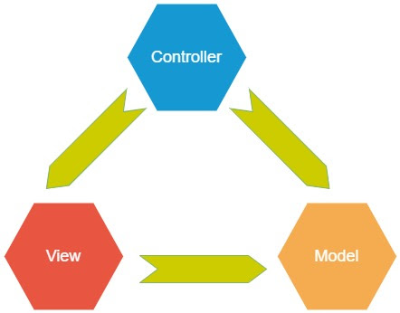

# MVC and MVVM: Software Architectural Patterns and Communication
*Don't pull all your eggs in one basket!*

MVC and MVVM are two popular software architectural patterns that are commonly used in the development of modern applications.
   
The main idea between both patterns is to address the principle of the *Seperation of Concerns*.   
The goal of Seperation of Concerns is to establish a well-organised system, where each section has its own specific, designated role, allowing a project to be well managed and easier to grow.

## Model-View-Controller (MVC)
MVC, or Model-View-Controller, is a software architecture pattern that divides an application into three main components: the model, the view, and the controller.

The ***model*** represents the data and the business logic of the application. It is responsible for managing the data and ensuring that it is up-to-date and accurate.

The ***view*** is the user interface of the application. It is responsible for displaying the data to the user and providing a way for the user to interact with the application.

The ***controller*** is the component that mediates between the model and the view. It is responsible for handling user input and updating the model and the view accordingly.

In an MVC architecture, the model, view, and controller are all independent components that communicate with each other through well-defined interfaces. This allows for a clean separation of concerns, making it easier to develop and maintain the application.

???+ info "MVC"
    

???+ warning "Note"
    The example above follows the linear implementation of the MVC pattern. You may see examples of the triangular implementation of MVC which is still a completely valid implementation. The only difference, in principle, is how each section communicates with one another.
    

???+ warning "Each framework is different!!!"
    While the idea is still the same, each framework implements each section of the MVC pattern slightly differently. Get to know your framework!

## Model-View-ViewModel (MVVM)
MVVM, or Model-View-ViewModel, is a software architecture pattern that is similar to MVC, but with some important differences. It is an architectural pattern used for building user interfaces in modern application development frameworks

In an MVVM architecture, the view and the controller from the MVC pattern are combined into a single component called the ***View Model***. The view model exposes data to the View, and translates user actions, such as button clicks, into commands that are sent to the Model to perform the appropriate business logic.

One of the key advantages of MVVM is that it allows for a better separation of concerns between the view and the view model. In MVC, the controller is often tightly coupled to the view, making it difficult to reuse or test. In MVVM, the view model is completely independent of the view, allowing for easier testing and reuse.

