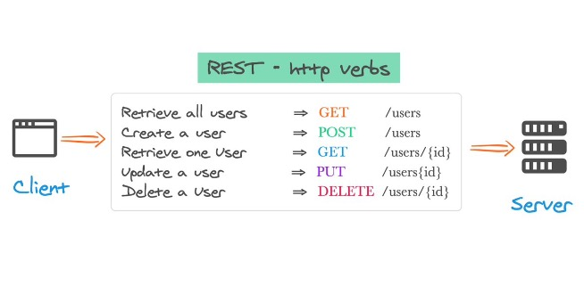

# MVC and MVVM: Software Architectural Patterns and Communication
*Don't pull all your eggs in one basket!*

## Content
  - [Software Architecture](#software-architecture)
    - [Model-View-Controller (MVC)](#model-view-controller-mvc)
    - [Model-View-ViewModel (MVVM)](#model-view-viewmodel-mvvm)
    - [MVC or MVVM?](#mvc-or-mvvm)
        - [Pros and Cons of MVC](#pros-and-cons-of-mvc)
        - [Pros and Cons of MVVM](#pros-and-cons-of-mvvm)
  - [Communication](#communication)
    - [Application Programming Interfaces (API)](#application-programming-interfaces-api)
    - [REST: Representation State Transfer](#rest-representation-state-transfer)
        - [Why REST APIs?](#why-rest-apis)
  - [Demo](#demo)
  - [Resources](#resources)

## Software Architecture
The main idea behind implementing software architectural patterns is to address the principle of the *Separation of Concerns*.   

The goal of Separation of Concerns is to establish a well-organised system, where each section has its own specific, designated role, allowing a project to be well managed and easier to grow.

Software architecture is the high-level structure of a software system, comprising the overall design of the system, the relationships between its components, and the principles that govern its design and evolution. Architecture is important because it provides a blueprint for the design and implementation of a software system, and defines the ways in which the system can be modified and extended over time.

The architecture of a system is critical to the success of the software as it sets the foundations of the project, providing the basis to ensure quality and maintainability of the system. A well-designed architecture can make it easier to develop and test the system, and can help to ensure that it is flexible, **scalable**, and reliable. 

By separating concerns, we can use different technologies for each section which will allow us to decide what stack to use during development. These choices can optimise the performance, development, and testing of the system.

???+ warning "Beware! Poorly designed system inside!"
    
    

### Model-View-Controller (MVC)
MVC, or Model-View-Controller, is a software architecture pattern that divides an application into three main components: the model, the view, and the controller.

The ***model*** represents the data and the business logic of the application. It is responsible for managing the data and ensuring that it is up-to-date and accurate.

The ***view*** is the user interface of the application. It is responsible for displaying the data to the user and providing a way for the user to interact with the application.

The ***controller*** is the component that mediates between the model and the view. It is responsible for handling user input and updating the model and the view accordingly.

In an MVC architecture, the model, view, and controller are all independent components that communicate with each other through well-defined interfaces. This allows for a clean separation of concerns, making it easier to develop and maintain the application.

???+ info "MVC"
    

???+ warning "Note"
    The example above follows the linear implementation of the MVC pattern. You may see examples of the triangular implementation of MVC which is still a completely valid implementation. The only difference, in principle, is how each section communicates with one another.
    

???+ warning "Each framework is different!!!"
    While the idea is still the same, each framework implements each section of the MVC pattern slightly differently. Get to know your framework!

### Model-View-ViewModel (MVVM)
MVVM, or Model-View-ViewModel, is a software architecture pattern that is similar to MVC, but with some important differences. It is an architectural pattern used for building user interfaces in modern application development frameworks

In an MVVM architecture, the View and the Controller from the MVC pattern are combined into a single component called the ***ViewModel***. The ViewModel exposes data to the View, and translates user actions, such as button clicks, into commands that are sent to the Model to perform the appropriate business logic.

The ViewModel and View are binding together in a process called *data binding*. Data binding is the process of establishing a connection between the user interface (the View) and its underlying data model (the ViewModel). This allows for direct communication between the two, meaning the UI updates as the data changes and actions are processed by the ViewModel as soon as they happen on the View.

???+ info "MVVM"
    

### MVC or MVVM?
The right architecture has to be used for the right job, and with the right frameworks. And while MVC and MVVM work in similar ways, they each have their on advantages and disadvantages.

#### Pros and Cons of MVC
| Pros | Cons |
| --- | ----------- |
| Clear separation of concerns between the application's data model, user interface, and control logic | Difficult to implement in some programming languages and frameworks, especially those that do not have built-in support for the pattern |
| Easier to develop and maintain large, complex applications, and allows different aspects of the application to be developed and tested independently | Harder to develop modern user interfaces |

#### Pros and Cons of MVVM
| Pros | Cons |
| --- | ----------- |
| Provides a more flexible and powerful architecture for building GUI applications | Can be more difficult to implement than MVC in some cases, and it may require a more complex and sophisticated development environment in order to take full advantage of its capabilities |
| Data binding | Data binding |
| Data binding automatically synchronises the application's user interface and data model, which can make it easier to implement complex features and interactions | Use of data binding can make it harder to debug and troubleshoot applications, since changes to the data model may not always be immediately visible in the user interface |

#### Summary
There are plenty of architectural design patterns for all your software needs. Many are far too complicated and extensive to use in our case. MVC and MVVM are simple in design and easy to implement, making them among the most popular design patterns and perfect for developing web applications.

## Communication

Now that we're experts in designing systems, let's talk about how each part of the system actually communicates with each other.

???+ warning "Disclaimer"
    There are many more ways that systems communicate with each. However, we will only cover the basics required in web development.

    If you feel like learning more about the different software communication channels that exist, a good place to start is with sockets or buses!   
    
    

### Application Programming Interfaces (API)
An API is a mechanism that allows two software components to communicate with other using a set of definitions and protocols. It is a sort of middleman that enables different software programs to communicate and share data in a consistent and predictable manner.

APIs can act as the "Controller" in MVC systems. The API will handle incoming requests from the frontend (the View), perform some logic which may include fetching data from the Model, then return responses to the client. They can also be used in MVVM architecture to allow communication between the ViewModels and the Models, as well as between any other services used.  

### REST: Representation State Transfer
RESTful APIs are application programming interfaces that follow the constraints of REST architectural style and allows for interaction with RESTful web services. You can read more about the details of REST, [here](https://www.redhat.com/en/topics/api/what-is-a-rest-api).   

In terms of using RESTful APIs, there are some naming and implementing conventions used to accurately label the endpoint with what it does.
???+ info "CRUD to HTTP Verb Matching for JSON standard communications with REST-APIs"
    CRUD stands for Create, Read, Update, and Delete. RESTful APIs use HTTP verbs to specify the CRUD operation an endpoint is performing.

    | HTTP Verb | CRUD Operation |    
    | --------- | -------------- |
    | POST | Create/Update |
    | GET | Read |
    | PUT | Update/Replace |
    | PATCH | Update/Modify |
    | DELETE | Delete |

    

#### Why REST APIs?
There are many advantages to using RESTful APIs compared to other frameworks. These include:

- Scalability
    - Are able to handle a large number of requests without affecting performance
    - Stateless nature allows each request to be handled independently
- Flexibility
    - Support a wide range of data formats and content types
    - More resilient to change
- Interoperability
    - Are able to be used by a wide range of clients
    - Allows developers to build applications that can integrate with a variety of different systems and services
- Ease of use
    - Follow a simple, standardised protocol (HTTP, HTTPS)
    - To request a resource via a REST API, you just need to provide its URL

## Demo
We will be doing a demo to build simple MVC and MVVM applications (if time persists).

## Resources
Keep the learning going!

Find some useful resources below:

- [MVC Framework - Introduction](https://www.tutorialspoint.com/mvc_framework/mvc_framework_introduction.htm)
- [The Model-View-ViewModel Pattern](https://learn.microsoft.com/en-us/xamarin/xamarin-forms/enterprise-application-patterns/mvvm)
- [MVC vs MVVM – Difference Between Them](https://www.guru99.com/mvc-vs-mvvm.html)
- [Red Hat: What is an API?](https://www.redhat.com/en/topics/api/what-are-application-programming-interfaces)
- ["What is a REST API?" by Jamie Juviler](https://blog.hubspot.com/website/what-is-rest-api)
- [Talk to an AI! (ChatGPT)](https://chat.openai.com/chat)
    - DISCLAIMER: May generate incorrect information
