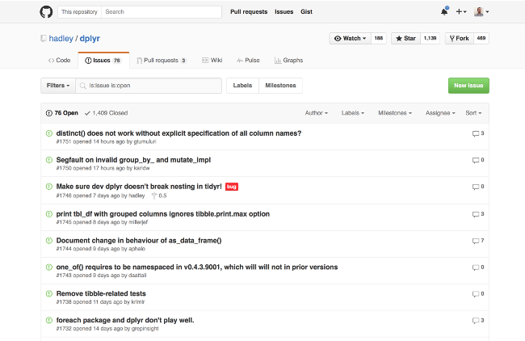
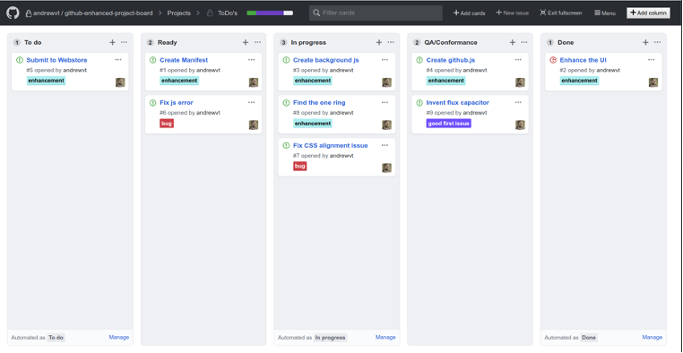
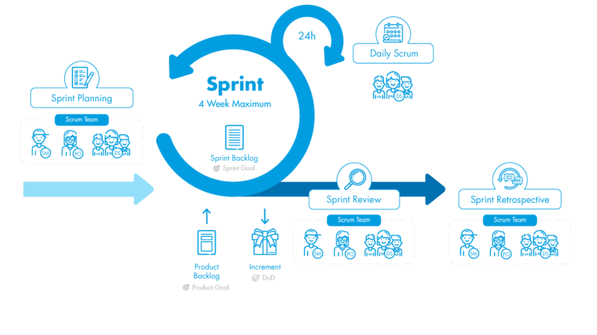

*How software engineer [GSD](https://www.atlassian.com/team-playbook/plays/gsd-day)!*

---

## How do software engineers work?
They use **issue/ticket management system** to track their work.

???+ example "Github Issues and Jira"
    The examples are Github Issues and Jira.

    
    

Listing of issues can be displayed in **kanban boards**.

???+ example "Kanban Boards"

    
    

---

## Why do Software Engineers Work like this?

<iframe width="100%" height="500rem"
src="https://www.youtube.com/embed/oyVksFviJVE" 
frameborder="0" 
allow="accelerometer; autoplay; encrypted-media; gyroscope; picture-in-picture" 
allowfullscreen></iframe>

???+ info "Scrums"
    One example of "agile" ways of working and it looks like this.
    

---

## What is Git?
<iframe width="100%" height="500rem"
src="https://www.youtube.com/embed/hwP7WQkmECE" 
frameborder="0" 
allow="accelerometer; autoplay; encrypted-media; gyroscope; picture-in-picture" 
allowfullscreen></iframe>

Git is a

- **version control system**
- tools for **coordinating work for different changes**

### Main Parts of Git

Main Parts of git:

- Change Node (commit node)
- Branch

### Git Different Versions

??? info "Software Versions"
    {align=left}

**Nodes**
- Representation of a change (commits + merge)

**Main/Master:**
- Branch usually as production or deployed

**Development Branch**
- Branch used for development
Used for compiling features for a release

**Feature Branch**
- Branch used for development for a
particular issue

---

## GitHub and Code Repositories

**GitHub**
- Place to hold code repositories

**Repositories**
- Place where codes are stored with different versions

---

## INTERACTIVE WORKSHOP TIME !!!!
1. Do the following from [codersforcauses/software-engineering-practices-demo-2024-summer](https://github.com/codersforcauses/software-engineering-practices-demo-2024-summer): Demonstration of software engineering practices (github.com):
2. Look at the GitHub issues
3. Assign yourself an issue
4. Clone repo with `git clone https://github.com/codersforcauses/software-engineering-practices-demo-2024-summer.git`
5. Create a branch with the following format s{Issue Number}-{Issue Name}. `git checkout -b {Issue Number}-{Issue Name}`
6. Create the change to satisfy or complete the github issue
7. Commit (package) the change `git commit -m "{insert message here}"` and push git push.
8. Create a pull request and request for a reviewer from CFC peeps

---

## Other Resources
- [Git and Github](https://www.youtube.com/watch?v=HkdAHXoRtos)
- [Superpowers Of Git](https://webakari-docs.vercel.app/developers/)