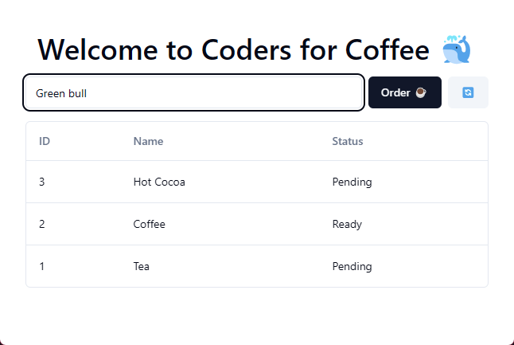
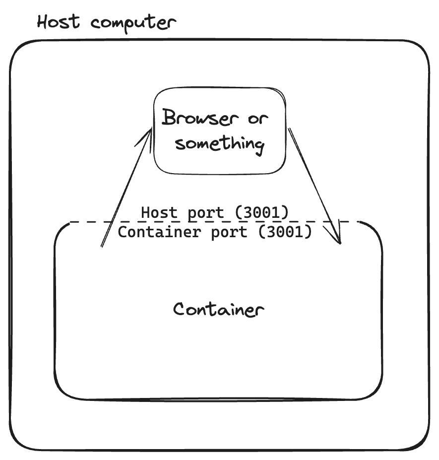

## Prerequisites

You need the following installed:

- [Git](https://git-scm.com/downloads)
- [Node.js](https://nodejs.org/en/download)
- [Docker](https://www.docker.com/get-started/)
- [VSCode](https://code.visualstudio.com/download) (highly recommended)

The starting repo for this workshop: <https://github.com/codersforcauses/docker-workshop>

## What you will be building as part of this workshop?

CFC wants to make an app for accepting coffee orders. You will be creating a Dockerfile for CFC's (totally real) new and upcoming rebrand: *Coders for Coffee 🐳*. The architecture is a simple frontend and backend both made in TypeScript. Below is a diagram of it:


## Important information

This workshop relies on a certain understanding of terminal commands and a bit of familiarity with Node.js projects.

## What is Docker?

Docker is a platform for developing, shipping, and running applications using containerization. It allows you to package an application and its dependencies into a container that can run on any machine. This makes it easy to deploy applications in a consistent and reproducible way. Simply put, it's like a way of running mini virtual machines inside your computer.

### Why use Docker?

- **Consistency**: Docker containers are isolated from the host system and other containers, ensuring that the application runs the same way everywhere.
- **Portability**: Containers can be run on any machine that has Docker installed, making it easy to move applications between environments.
- **Efficiency**: Containers are lightweight and share the host system's resources, making them more efficient than virtual machines.
- **Scalability**: Docker makes it easy to scale applications by running multiple containers on the same host or across multiple hosts.
- **Security**: Containers are isolated from each other and the host system, providing an additional layer of security.
- **DevOps**: Docker is a key tool in the DevOps toolchain, enabling developers to build, test, and deploy applications more easily. Imagine a software job where instead of writing software for end-users, you write software to make developers' lives easier!

### Definitions

- **Dockerfile 📜**: A text file that contains instructions for building a Docker **image**. It specifies the base image, dependencies, environment variables, and commands to run when the container starts. Think like a recipe for baking a cake.
- **Image 📀**: A read-only template with instructions for creating a Docker **container**. It contains the application code, runtime, libraries, environment variables, and configuration files. Think like a CD with music on it.
- **Container ▶️**: An instance of an image that can be run as a process on the host machine. It is isolated from other containers and the host system. Think like a CD in a CD player.

### How do I use Docker?

This is a high-level overview of how Docker works:


In action, you'll only need to know a few commands to get started:

1. `docker pull`: Pull an **image** from a **registry** (like Docker Hub).
2. `docker run <image>`: Run a **container** from an **image**.
3. `docker build`: Build a **Dockerfile** into an **image**.

## Getting started

Firstly, open your IDE and open the terminal.

1. Clone the repository: `git clone https://github.com/codersforcauses/docker-workshop.git`
2. Go to the directory: `cd docker-workshop`
3. Run the setup script: `npm run setup`
4. Run the app: `npm run dev`. Visit [http://localhost:3000](http://localhost:3000) to see it in action.

??? info "What does the setup script do?"
    The setup script installs the dependencies for both the frontend and backend. It is located in the `package.json` in the root. Formatted nicely:

    ```bash
    npm install --prefix apps/frontend -g && # install dependencies for the frontend
    npm install --prefix apps/backend -g && # install dependencies for the backend
    npm install # install dependencies for the root (just a little handy package to run both apps with one command)
    ```

## What does the app do?

The frontend is a simple form that takes a user's order and sends it to the backend. The backend then saves the order to a "database". Below is a screenshot of the app:



### Frontend

The frontend is a single page app that takes orders. It runs at <http://localhost:3000>.

??? info "Where is the frontend code?"
    The frontend code is located in the `apps/frontend` directory. The main file is `src/App.tsx`.

### Backend

The backend is a simple Hono http server that listens for certain requests. It runs at <http://localhost:3001>. There are 3 important endpoints:

1. `GET /` - Show a simple page to check if the server is running
2. `GET /orders` - Get all orders
3. `POST /orders` - Create an order

??? info "Where is the backend code?"
    The backend code is located in the `apps/backend` directory. The main file is `src/index.ts`.

You can view the first two by going to <http://localhost:3001> and <http://localhost:3001/orders> in your browser.

## What do we need to do?

We need to create a **Dockerfile** to **build** the frontend and backend to **images**, then run them as **containers**. I have already created a Dockerfile for the backend, which is located in the `apps/backend` directory. You will need to create a Dockerfile for the frontend.

??? info "Can I cheat?"
    Yes... If you choose to look at it, you might find it helpful. However, it comes with a few optimisations which may be confusing.

## Building and Running an Image

Close the app dev server we ran earlier with `CTRL+C`.

Let's start by learning how to build and run a Docker image. First, let's build the backend:

```bash
docker build -t docker-workshop-backend ./apps/backend
```

This command builds an image from the Dockerfile in the `apps/backend` directory and tags it (`-t`) with the name `docker-workshop-backend`.

Now, let's run the image we've built:

```bash
docker run -p 3001:3001 docker-workshop-backend
```

!!! warning "Port Mapping"
    But wait, what does `-p 3001:3001` do? I mentioned earlier that Docker basically runs mini virtual machines --- so let's visualise what that looks like.

    

    In order for our container to make connect with the outside world, we need to create a little tunnel. This is done by mapping a port on the host machine to a port on the container. In our case, I've configured the backend to run internally on port `3001`. Therefore, we need to map that internal port to a port on the host machine so we can access it. I kept it simple and mapped it to the same port, but you can change it to any port you like (given our frontend knows about it). Ports are mapped like this: `-p <host-port>:<container-port>` This is one of the security goals of Docker.

Now, visit [http://localhost:3001](http://localhost:3001) to see the backend now running from a Docker container.

## Manual Build

To get a better idea of what we need to do, let's build the frontend manually.

### Step 1: What are we building?

Imagine you are a robot that will execute commands to build the app to be production-ready. Regardless of what you're making, it'll usually fall into this pattern:

1. Install dependencies
2. Build the app
3. Serve the build files

### Step 2: Mapping them to commands

The frontend is a React app that uses TypeScript. Now let's:

1. Install dependencies: `npm install`
2. Build the app: `npm run build`
3. Serve the build files: `npm run preview`

The `build` and `preview` scripts are located in `apps/frontend/package.json`.

```json
{
    // ...
    "scripts": {
        "build": "tsc && vite build",
        "preview": "vite preview"
    }
    // ...
}
```

You can run these commands in the terminal and open it up at <http://localhost:4173/> to see the optimised production build of the frontend. Notice how the bottom text has changed from "development" to "production".

## Creating a Dockerfile

When creating a Dockerfile, it's essentially the same process as manually doing it. The only difference is that you're automating it in a file.

### Base Image

All Dockerfiles start with a `FROM` command, which specifies the base image to use. This image is usually a lightweight Linux distribution with the necessary tools and libraries to run the application. For our frontend, we will use the [`node:20-alpine`](https://hub.docker.com/_/node) image.

???+ info "How do I know what image to use?"
    There are a number of things to consider when choosing a base image:

    - **Application**: Because we're running a Node.js app, an image with Node.js already installed is a good choice.
    - **Size**: Smaller images are faster to download and use less disk space.
    - **Security**: Official images are more secure and are regularly updated. Most of the time you'll be using images from Docker Hub.
    - **Compatibility**: Make sure the image is compatible with your application. In this case, the current LTS release for Node.js is 20, so we will use `node:20-alpine`. Locking the version down is also good practice to prevent images from suddenly breaking.

```dockerfile
# Use the official Node.js image as the base image
FROM node:20-alpine
```

### Working Directory

We're in linux land now. We're first going to create a directory to put our production files in. This is done with the `WORKDIR` command.

```dockerfile
FROM node:20-alpine

# Set the working directory in the container
WORKDIR /app
```

??? info "Why do we need a working directory?"
    The `WORKDIR` command sets the working directory for any subsequent commands in the Dockerfile. This is where the application code will be copied to and where the application will run from. It's like changing directories in the terminal. Just like your own computer, you don't want to group important system files with your projects. It can be named anything you like, but the general convention is to name it `/app`.

### Copying Files

Next, we need to copy our source code into the image. This is done with the `COPY` command.

```dockerfile
# Use the official Node.js image as the base image
FROM node:20-alpine
WORKDIR /app

# Copy the important files to the working directory
COPY package*.json tsconfig.json src ./
```

???+ info "What are we copying?"
    This command copies the `package.json`, `package-lock.json`, `tsconfig.json`, and `src` directory from the host machine to the working directory in the container (`./`). This is the bare minimum we need to build the frontend.

### Installing Dependencies and Building

Now that we have our source code in the image, we need to install the dependencies. This is done with the `RUN` command. Here, we run both `npm install` and `npm run build` in succession using `&&`.

```dockerfile
FROM node:20-alpine

WORKDIR /app
COPY package*.json tsconfig.json src ./

# Install dependencies
RUN npm install && npm run build
```

??? info "Why not do it on separate lines?"
    The reason we chain them together is to reduce the number of layers in the image. Each `RUN` command creates a new layer in the image, which is essentially a snap of everything you've `RUN` up until now. More layers means a larger image size. By chaining the commands together, we can reduce the number of layers and make the image smaller. Docker also uses this to cache layers, so if you change a file, it will only rebuild the layers that depend on that file, saving time. In our case, our two commands both depend on the files we, so we should group them together.

### Serving the Build

We're almost there! The last thing we need to do is serve the build files. This is done with the `CMD` command. This command specifies the command to run when the container starts. In our case, we want to run `npm run preview`.

```dockerfile
FROM node:20-alpine
WORKDIR /app

COPY package*.json tsconfig.json src ./

RUN npm install && npm run build

# Serve the build files
CMD ["npm", "run", "preview"]
```

We're done --- not. There's one last thing we need to do: specify the port the server will run on. This is done with the `EXPOSE` command. Notice how earlier, `npm run preview` actually started the server on port `4173`, so let's expose that instead.

```dockerfile
FROM node:20-alpine
WORKDIR /app

COPY package*.json tsconfig.json src ./

RUN npm install && npm run build

# Serve the build files
EXPOSE 4173
CMD ["npm", "run", "preview"]
```

### Done

 You can now build and run the frontend image. We can actually specify a specific port in the `CMD`, but I'm just going to map it to port `3000` on the host machine when running the container.

```bash
docker build -t docker-workshop-frontend ./apps/frontend
docker run -p 3000:4173 docker-workshop-frontend
```

## Optimising the Dockerfile

Let's think about what we've done. We've copied the source code, installed dependencies, built the app, and served the build files. But there are a few things we can do to optimise the Dockerfile:

- **Only have production dependencies in the image.** Sometimes we developers install dev dependencies that aren't needed in production, but make our lives easier. If you take a look at `apps/frontend/package.json`, you'll see a bunch of them.
- **Don't have the source code in the image.** We only need the built files to run the app. This reduces the image size.

### Prune the Dependencies

TODO

### Multi-Stage Builds

TODO
