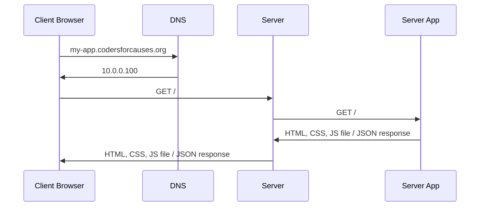
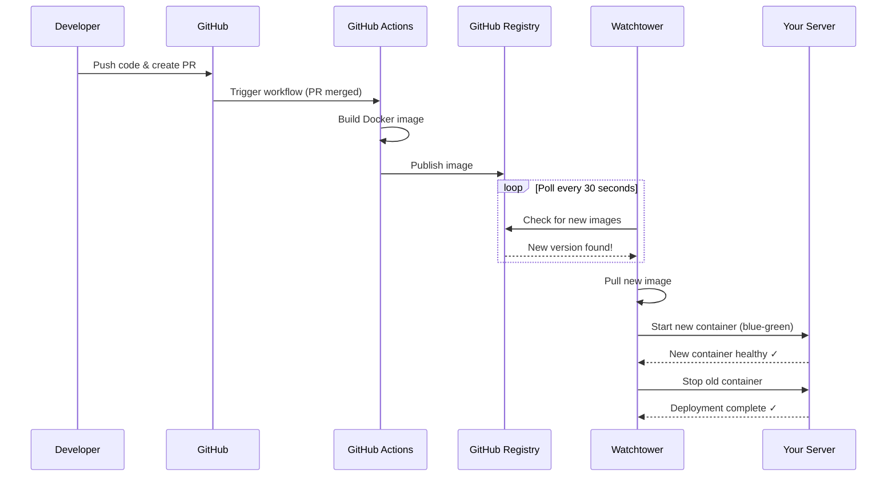

# Getting Your App in the Internet
**An Introduction to Infrastructure to Host Your App in the Internet**

Presented By:

- [Frinze Lapuz](https://www.linkedin.com/in/frinze-erin-lapuz/), Developer Experience Software Engineer at [Atlassian](https://www.atlassian.com/)


## Goal
After this workshop, you will be able to:

- Understand what's involved in hosting your app in the internet (from first principles)

??? info "Why are we learning from first principles?"
    First principle allows you to properly understand how each different parts of what we do connect with one another. When you know this first principle, whether you use AWS ECS, Google Cloud Run, Kubernetes, etc. - you'll be able to understand what it does under the hood enough for you to consider how that one particular tech handle the parts that we're doing in this workshop.

## Prerequisites

- Docker images already published in a public registry (eg. Docker Hub, Github Registry)
- DigitalOcean Account
- Domain name

## What do you need to host your app in the internet?

- Server (A computer that can run your server-side app such as Django or a "Static File App Server" to serve HTML, CSS, JS)
- Domain Name
- Your app 😄



## (Optional to follow) A Simple Practical Example of a Server: Your Laptop as a Server for your Phone

???+ warning "This will not work in more complicated Networking"
    This is a simple example to help you understand the concept. This will not work for complicated networking such as the one that university has

1. Try turning on the hotspot of your phone
2. Connect your laptop to the hotspot
3. Create a simple html file with the content "Hello, World!" and name it `index.html`

```html
<html>
    <body>
        <h1>Hello, World!</h1>
    </body>
</html>
```

4. Using the command below, serve the html file

```bash
python -m http.server 8000 # or any port you like
```

5. Confirm that when you go to [http://localhost:8000](http://localhost:8000), you see the "Hello, World!" message. 

So far in this example - you have the server (your laptop) and the client (your laptop). Your browser requests the html file from the "localhost" address (also known as the "127.0.0.1" address).

Now let's get your phone accessing your laptop's server.

6. Run the command below to get your laptop's IP address

```bash
ipconfig # on Windows
ipconfig # on Mac
ip addr # on Linux
```

???+ note "Your device can have multiple IP addresses"
    Your device can have multiple IP addresses. It depends on how many network interfaces your laptop has an how many its connected to.

    Eg. if your device supports both WiFi and Ethernet, it will have two IP addresses. One for WiFi and one for Ethernet.

Mac it somewhat looks like this
```bash
$ ipconfig
...
en0: flags=8863<UP,BROADCAST,SMART,RUNNING,SIMPLEX,MULTICAST> mtu 1500
        options=6460<TSO4,TSO6,CHANNEL_IO,PARTIAL_CSUM,ZEROINVERT_CSUM>
        ether c8:89:f3:a9:47:9d
        inet6 fe80::c8f:ef7d:77d3:d776%en0 prefixlen 64 secured scopeid 0xf 
        inet6 fd24:1169:9b10:1:886:2d84:cf22:81f5 prefixlen 64 autoconf secured 
        inet6 2403:9e00:80a2:d700:1ca7:58a8:6721:5d0d prefixlen 64 autoconf secured 
        inet6 2403:9e00:80a2:d700:55e8:36dd:acbc:5710 prefixlen 64 autoconf temporary 
        inet 192.168.4.24  netmask 0xfffffc00 broadcast 192.168.7.255 
        nd6 options=201<PERFORMNUD,DAD>
        media: autoselect
        status: active
...
en7: flags=8863<UP,BROADCAST,SMART,RUNNING,SIMPLEX,MULTICAST> mtu 1500
        options=6464<VLAN_MTU,TSO4,TSO6,CHANNEL_IO,PARTIAL_CSUM,ZEROINVERT_CSUM>
        ether 60:6d:3c:53:6a:76
        inet6 fe80::14d1:4da8:9a33:e016%en7 prefixlen 64 secured scopeid 0x18 
        inet6 fd24:1169:9b10:1:1cc8:1137:aa39:47ac prefixlen 64 autoconf secured 
        inet6 2403:9e00:80a2:d700:bf:9cc1:da56:d1fd prefixlen 64 autoconf secured 
        inet6 2403:9e00:80a2:d700:4116:17ea:100e:8054 prefixlen 64 autoconf temporary 
        inet 192.168.4.41 netmask 0xfffffc00 broadcast 192.168.7.255
        nd6 options=201<PERFORMNUD,DAD>
        media: autoselect (1000baseT <full-duplex>)
        status: active
```

???+ info "Alternative for Mac"
    Your current Mac's IP address is viewable in Apple -> About this Mac ->System Report -> Network.

7. On your phone, go to the browser and type in the IP address you got from the previous step

8. You should see the "Hello, World!" message.

???+ info "Fun fact: Mobile Development"
    If you're developing on mobile devices, and you want to test it live on your phone connected to your backend, this is somewhat the networking setup you'll need. The phone can talk to your laptop's server via the IP address you got from the previous step.

## (Optional) Assigning a "Local Domain Name" to your laptop

1. On your laptop, create a file called `hosts` in the `/etc/` directory
2. Add the following line to the file:

```text
127.0.0.1 my-app.local
```

3. Restart the computer
4. Now when you go to your laptop and open the browser, you can type in `http://my-app.local:8000` to access your app with the local domain name.

## Interactive Workshop Time: Taking it now to the cloud!

???+ info "It is highly recommended that you follow along with the workshop"
    It is highly recommended that you follow along with the workshop. This will help you understand the concepts better because you'll get your hands dirty, see things for yourself!

Congratulations! You have successfully hosted your app already in your local network!

However, there's a couple of things now that you need to consider:

1. Your laptop is not always on
2. Your laptop is not always connected to the internet with the accessible IP address
3. Other devices don't know the "domain name" to get to your laptop.

In this workshop, we'll be focusing on hosting your app in the cloud.

??? info "Self-Hosting"
    If you're interested in what's involved in self-hosting, there's only really a couple of differences.

    Firstly, you'll need to set your server up to always have power and always running. The next is, you'll need to configure your server to accessible in the public internet. Your router that you have will have an assigned public IP address. You just need to configure your router to do "port-forwarding" via private IP address to your server.

    So imagine a layout a like this:
    - say your public IP address is 10.0.0.100
    - the private IP address of your server is 192.168.1.100
    - you need to configure your router to forward requests of port 8000 of 10.0.0.100 to 192.168.1.100

    ```
    +----------------+        +----------------+
    |                |        |                |
    |     Router     |   -->  |     Server     |
    |    10.0.0.100  |        | 192.168.1.100  |
    |    8000        |        | 8000           |
    +----------------+        +----------------+
    ```
    With this case your website will now be accessible at `http://10.0.0.100:8000`.

    For domain name, it will be the same as if you're in the cloud. You just need to configure your DNS to point to your server.

### Getting a computer in the cloud

For this workshop, we'll be using [DigitalOcean](https://www.digitalocean.com/) as our cloud provider.

You can use other providers such as AWS EC2, GCP Compute Engine, etc.

1. Login to DigitalOcean
2. Go to Droplet -> Create a new Droplet. Select these options
      1. Region: Pick a region closest to you (for Perth - it will either be Singapore or Sydney)
      2. Choose an Image: Go to "Marketplace" and search "Docker" (You'll probably find - "Docker latest on Ubuntu 22.04"). Choose that
      3. Droplet Type: Just do Basic (but it's up to you)
      4. CPU Options: Regular (Disk type: SSD). `$6/mo` (the lowest possible option) should be enough
      5. Authentication Method: Select SSH Key - then add a new SSH key. Follow the instructions. If this doesn't work, please ask for help.
3. Once you've created the Droplet, you'll be able to see the IP address of the Droplet.
4. Connect to the Droplet using the SSH key you added.

    ```bash
    ssh -i ~/.ssh/id_rsa root@<your-droplet-ip-address>
    ```

    If you're using a passphrase, you'll be prompted to enter it.

    ```bash
    Enter passphrase for key '/Users/USER/.ssh/id_rsa':
    ```

    Once you're connected, you can start using the Droplet.

In my case - this is the command i ran

```
 ssh root@157.245.187.37
The authenticity of host '157.245.187.37 (157.245.187.37)' can't be established.
ED25519 key fingerprint is SHA256:WR5w09c9bLaCjCNGcvaAmgtTx3M1LzqsqGeG6LL36ew.
This key is not known by any other names.
Are you sure you want to continue connecting (yes/no/[fingerprint])? yes
Warning: Permanently added '157.245.187.37' (ED25519) to the list of known hosts.
Welcome to Ubuntu 22.04.5 LTS (GNU/Linux 5.15.0-153-generic x86_64)

 * Documentation:  https://help.ubuntu.com
 * Management:     https://landscape.canonical.com
 * Support:        https://ubuntu.com/pro

 System information as of Sun Jan  4 15:21:24 UTC 2026

  System load:  0.92              Processes:             112
  Usage of /:   5.6% of 77.35GB   Users logged in:       0
  Memory usage: 7%                IPv4 address for eth0: 157.245.187.37
  Swap usage:   0%                IPv4 address for eth0: 10.46.0.5
...
```

??? info "Why are we choosing from Market place, and not just go to OS?"
    In this workshop, we are wanting to use "Docker". We'd like it to preferably be preinstalled.

??? info "SSH Key Setup"
    At a basic case you'll do the following 

    **Create a new key pair, if needed**
    Open a terminal and run the following command:

    ```bash
    ssh-keygen
    ```

    You will be prompted to save and name the key.

    ```bash
    Generating public/private rsa key pair. Enter file in which to save the key (/Users/USER/.ssh/id_rsa):
    ```

    Next you will be asked to create and confirm a passphrase for the key (highly recommended):

    ```bash
    Enter passphrase (empty for no passphrase):
    Enter same passphrase again: 
    ```

    This will generate two files, by default called `id_rsa` and `id_rsa.pub`. Next, add this public key.

    **Add the public key**

    Copy and paste the contents of the .pub file, typically id_rsa.pub, into the SSH key content field on the left.

    ```bash
    cat ~/.ssh/id_rsa.pub
    ```

    For more detailed guidance, see [How to Add SSH Keys to Droplets](https://docs.digitalocean.com/products/droplets/how-to/add-ssh-keys/)

Okay you now have a computer in the cloud!!! 🎉

## Let's try serving just some hello world app!

1. Run the command below to run something in port 80

```bash
docker run --rm --name web-test -p 80:8000 crccheck/hello-world
```

2. Go to the browser and type in the IP address of the Droplet. You should see 

```text
Hello World


                                       ##         .
                                 ## ## ##        ==
                              ## ## ## ## ##    ===
                           /""""""""""""""""\___/ ===
                      ~~~ {~~ ~~~~ ~~~ ~~~~ ~~ ~ /  ===- ~~~
                           \______ o          _,/
                            \      \       _,'
                             `'--.._\..--''
```

Now that's a demonstration of you serving something in the wider internet!

## Let's add a Recognizable Domain Name to your app!

??? note "Where do you buy domain names?"
    You can buy it in multiple providers. If you want recommendations, Namecheap and Cloudflare are good options.

    Cloudflare gives you an extra feature about protected DNS by doing "proxy" mode. This means that the IP address associated with the domain name is the IP address of the Cloudflare server. Only when the request is "allowed" (by your rules), the request is forwarded to your server, so you don't expose the IP address of your server to the wider internet.

    Here's how it works:

    ```mermaid
    sequenceDiagram
        participant Client as Client Browser
        participant DNS as DNS Server
        participant CF as Cloudflare Proxy
        participant Server as Your Server
        
        Client->>DNS: What's the IP for my-app.codersforcauses.org?
        DNS-->>Client: Cloudflare's IP (not your server IP)
        Client->>CF: GET my-app.codersforcauses.org (request)
        CF->>CF: Check security rules
        
        alt Request Allowed ✓
            CF->>Server: Forward request
            Server-->>CF: Response (HTML, JSON, etc)
            CF-->>Client: Response
        else Request Blocked ❌
            CF-->>Client: 403 Forbidden / Error Response
        end
        
        Note over Client,Server: Your actual server IP stays hidden! 🔒
    ```

Assuming you now have a domain name (or you're borrowing the codersforcauses.org domain name), you can now configure your DNS to point to your server.

???+ info "Subdomains"
    For this workshop, we'll give you access to subdomains of codersforcauses.org. We are able to create as much subdomain for you.

You may want to create a subdomain for your app.

Borrow a CFC Laptop logged in to the Cloudflare DNS management page.

Create a "CNAME" record for your subdomain pointed to your server's IP address.

```
my-app.codersforcauses.org. IN CNAME <your-server-ip-address>.
```

Save the changes.

Now you can access your app at `http://my-app.codersforcauses.org`.

## Let's now focus on serving your backend and frontend!

???+ info "What is Docker?"
    Docker is a way to package your application and its dependencies, so you can easily just run it. It's essentially a way to make your app "portable".

    In the previous example, we just took some app in the internet and served it with just one command.

    However, what we're about to do in this next section is going to use that same concept (while a bit more complex) to serve your backend and frontend.

For this workshop, I'm modelling the repository [django-nextjs-template](https://github.com/codersforcauses/django-nextjs-template).

In this template, we publish two docker images:

- Frontend: `ghcr.io/codersforcauses/django-nextjs-template-prod-client` (accessible [here](https://github.com/codersforcauses/django-nextjs-template/pkgs/container/django-nextjs-template-prod-client))
- Backend: `ghcr.io/codersforcauses/django-nextjs-template-prod-server` (accessible [here](https://github.com/codersforcauses/django-nextjs-template/pkgs/container/django-nextjs-template-prod-server))

You will may have figured out that we have a "[Production Compose Files](https://github.com/codersforcauses/django-nextjs-template/blob/main/docker-compose.prod.yml)". This production compose file is essentially used to model the docker container networking.

??? info "Code of the compose"
    ```yaml
    services:
    db:
        image: postgres:16.4
        restart: unless-stopped
        volumes:
        - ./data/db:/var/lib/postgresql/data
        env_file: ./.env.prod
        healthcheck:
        test: ["CMD-SHELL", "pg_isready -U postgres"]
        interval: 3s
        timeout: 3s
        retries: 5

    server:
        image: ghcr.io/codersforcauses/django-nextjs-template-prod-server:latest
        restart: unless-stopped
        env_file: ./.env.prod
        ports:
        - 8081:8081
        entrypoint: /entrypoint.sh
        volumes:
        - ./opt/accesslogs/:/var/log/accesslogs/
        - ./opt/static_files:/opt/static_files
        environment:
        - DJANGO_SETTINGS_MODULE=api.settings
        depends_on:
        - db

    client:
        image: ghcr.io/codersforcauses/django-nextjs-template-prod-client:latest
        restart: unless-stopped
        env_file: ./.env.prod
        ports:
        - 3000:3000
        entrypoint: /entrypoint.sh
        depends_on:
        - server

    nginx:
        image: nginx:stable-alpine3.21
        restart: unless-stopped
        ports:
        - 80:80
        - 443:443

        volumes:
        - ./docker/nginx/custom.conf:/etc/nginx/nginx.conf
        - ./opt/static_files:/app/static_files
        depends_on:
        - server
        - client

    watchtower:
        image: containrrr/watchtower:latest
        restart: unless-stopped
        volumes:
        - /var/run/docker.sock:/var/run/docker.sock
        command: --interval 30
    ```

### Reverse Proxy and Networking

??? info "Raw Nginx Configuration"
    ```
    user nginx;
    worker_processes 1;
    error_log /var/log/nginx/error.log warn;
    pid /var/run/nginx.pid;

    events {
        worker_connections 1024;
    }

    http {
        include /etc/nginx/mime.types;
        default_type application/octet-stream;

        # upstream to the server container
        upstream backend {
            server server:8081; #name of container:port exposed
        }

            # upstream to the server container
        upstream frontend {
            server client:3000; #name of container:port exposed
        }

        server {
            listen 80;
            server_name _;

            # proxy to api
            location /api/ {
                proxy_pass http://backend;
                proxy_set_header X-Forwarded-For $proxy_add_x_forwarded_for;
                proxy_set_header Host $host;
                proxy_redirect off;
            }
            # proxy to django admin
            location /admin/ {
                proxy_pass http://backend;
                proxy_set_header X-Forwarded-For $proxy_add_x_forwarded_for;
                proxy_set_header Host $host;
                proxy_redirect off;
            }
            # serve django static files
            location /static/ {
                alias /opt/static_files/;
            }
            # proxy to client
            location / {
                proxy_pass http://frontend;
                proxy_set_header X-Forwarded-For $proxy_add_x_forwarded_for;
                proxy_set_header Host $host;
                proxy_redirect off;
            }
        }
    }
    ```

Visually here's what the networking looks like

```
                        CLIENT BROWSER
                              │
                   Request: my-app.domain.org
                              │
                    ┌─────────▼────────┐
                    │   VPS / Droplet  │
                    │  NGINX Reverse   │
                    │  Proxy:80/443    │
                    └─────────┬────────┘
                              │
              ┌───────────────┼────────────┬────────────┐
              │               │            │            │
          /api/*          /admin/*     /static/*      Default(/)
              │               │            │            │
         ┌────▼───┐      ┌────▼───┐   ┌───▼────┐  ┌───▼──────┐
         │Backend │      │Backend │   │Static  │  │Frontend  │
         │Docker  │      │Docker  │   │Files   │  │Docker    │
         │:8081   │      │:8081   │   │(disk)  │  │:3000     │
         │(Django)│      │(Django)│   │/opt/.. │  │(Next.js) │
         └────────┘      └────────┘   └────────┘  └──────────┘
```

This diagram shows:

1. **Client Browser** makes a request to your domain name (e.g., `my-app.codersforcauses.org`)
2. **VPS/Droplet** receives the request on port 80 (HTTP) or 443 (HTTPS)
3. **NGINX Reverse Proxy** inspects the request path and routes it:
   - `/api/*` → Backend Container (Django, port 8081)
   - `/admin/*` → Backend Container (Django, port 8081)
   - `/static/*` → Static Files served from disk (`/opt/static_files/`)
   - Default `/` → Frontend Container (Next.js, port 3000)

This setup allows you to serve both frontend and backend from a single domain name and port, with NGINX intelligently routing requests to the appropriate service.

## Running your app!

Setup your `.env.prod` file. You can use the `.env.prod.example` file as a template.

Check your `docker-compose.prod.yml` file to make sure it points to the correct images reference (this will change depennding on what the repo name you have).

Once everything is ready, run

```
docker compose -f docker-compose.prod.yml up -d
```

You should now be able to access your app at `http://my-app.codersforcauses.org`.


## (Optional) CD (Continuous Deployment / Continuous Delivery)

So far we've setup the infrastructure to host your app. However, when you do software development professionally, you will write code all the time, and also make sure your code gets to production.

The process of automating how your code gets to production is called "Continuous Deployment" (sometimes it's referred to as "Continuous Delivery" in a "Product Engineering" context where each code change is a "deliverable").

Here's the complete pipeline:



In this workshop, we've setup "Watchtower" to automatically update your app when you push to the repository. How it works is essentially, whenever there's a new image pushed to the registry, Watchtower will pull it, start the container with the new image and stop the old one.

Because we know that the images pushed to the registry happens only when code is merged to the main branch, this means that whenever you merge your code to the main branch, your app will automatically be picked up and deployed to your server.

For small projects, watchtower is a great way to automate your deployment. However, for larger projects with more critical serving requirements, you may want to use a more sophisticated CD tool (such as AWS ECS), but also other more sophisticated infrastructure setup such as supporting "Blue/Green" deployment, "Canary" deployment, "A/B" testing, etc.

(if none of these buzzwords make sense, search it. You'll learn a lot! 🤓).

??? info "Alternatives to Watchtower"
    On top of the commercial ones like AWS ECS, Google Cloud Run, etc. - you can use things like Docker Swarm, Kubernetes... Or if you want simpler, there's MicroK8s, k3s, or if you want even simpler... There's making Github actions SSH into your server and run the commands to deploy your app.

    But at the end of the day, these are all tradeoffs you gotta make between a number of factors:

    - Complexity of the infrastructure
    - Cost
    - Scalability
    - Reliability
    - Maintainability
    - Security
    - Performance
    - Availability
    - Disaster Recovery

    Sometimes if you want to be practical, choose the simplest one that works. A scalable and reliable app is useless if it doesn't have users 😜, so until you have proper users and you really need it to scale... Choose the simplest one that works!


## You're done!

Congratulations! You've now successfully hosted your app in the internet! 🎉

You can now start to build your own app and host it in the internet!

This is only a start! There's a lot more advanced techniques and concepts to learn about. However, this should give you a good foundation to start building your own app and hosting it in the internet! As any providers such as Heroku, AWS Lightsail, AWS ECS, AWS EKS, or even Kubernetes! All the concepts you learned today, thats what powers those tech!

If you have any questions, feel free to ask!