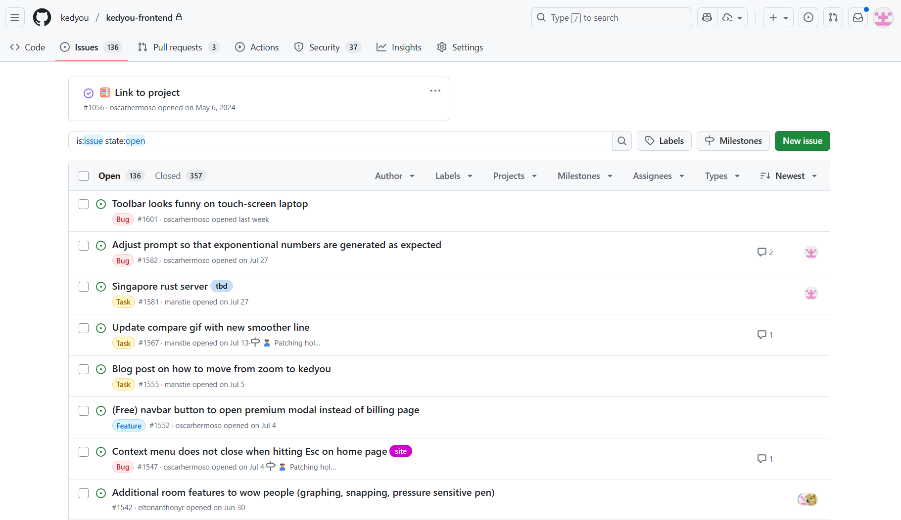
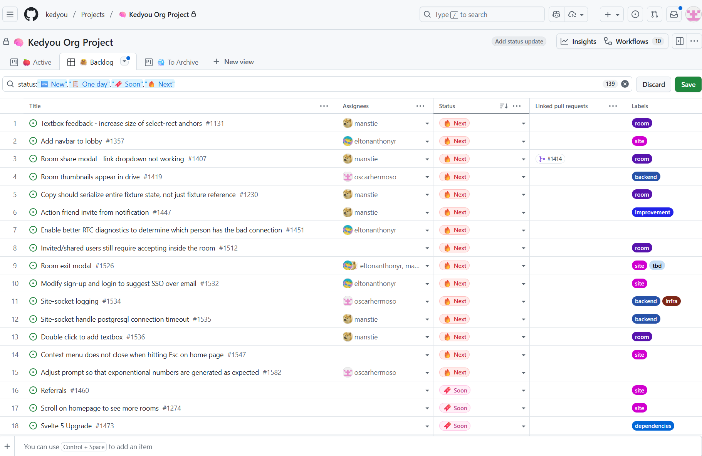
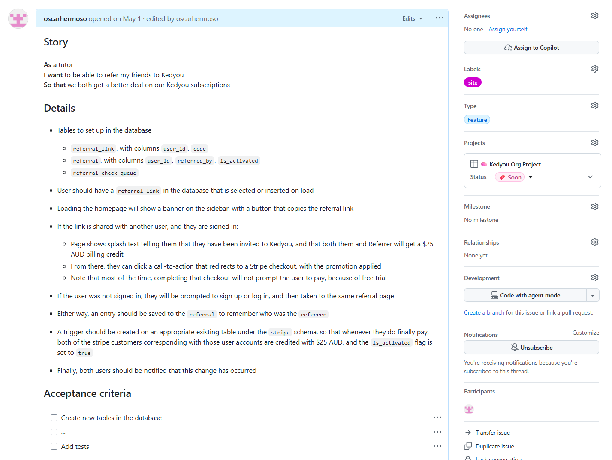
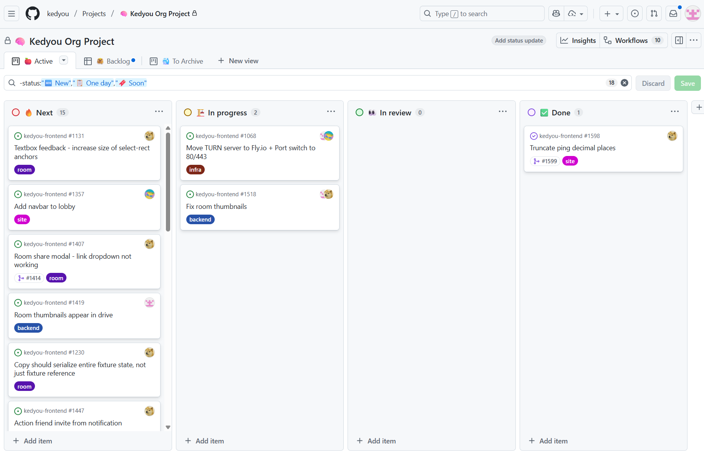
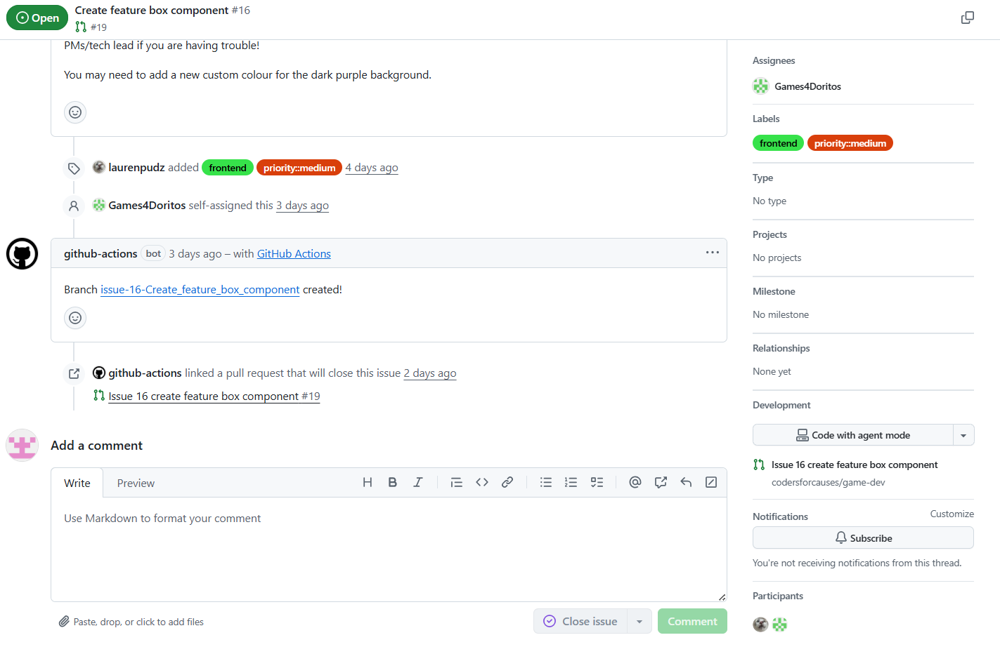

*How software engineer [GSD](https://www.atlassian.com/team-playbook/plays/gsd-day)!*

---

## Assumptions

- You are familiar with git

## Professional Workflow

1. Create a **Backlog** of work
2. Set goals & assign work in a **Planning** session
3. When picking up a new task, ask for a **Kick-Off** if you'd like more context/direction
4. Attend **Stand-Ups** every few days to share progress & blockers
5. Write & review code
6. Discuss improvements in a **Retrospective**
7. Demo to stakeholders in a **Showcase**

### Backlog

Use **issue/ticket management system** to prioritise a **backlog** of work.

_Anyone_ can raise issues, not just your project manager & tech lead.

### Planning

Teams prioritise their backlogs in **Planning/Refinement** sessions. For CFC, it might just be your PM & Tech Lead prioritising the backlog.

Use a technique like MoSCoW (Must have, Should have, Could have, and Won't have) to help sort your backlog.

GitHub Projects can be helpful here, because it lets you drag tickets to rank them by priority:

### Kick-Off

Often, issues won't spell out _exactly_ what needs to be done to complete them.

You might want to reach out to a few of your team-mates just to bounce a few ideas off each other & discuss how to get started.

Consider breaking a story down that's this large into subtasks!

### Stand-Ups

Often daily, or every second day, software delivery teams with "walk the board" at a stand-up.

Everyone speaks to their progress since the last stand-up, anything they are stuck on, and what they are planning to pick up next. If you don't know what to pick up next, call it out!

It's good to do a little bit of prep for these stand-ups to keep them moving quickly. Anything big should be "taken offline" (discussed after stand-up has finished).

Again, GitHub Projects can be helpful here!

### Write & Review Code

#### Branching

When you pick up a ticket (added as an "Assignee" on the GitHub Issue), CFC has some automation that automatically creates a branch.

It's good to use this branch for development to increase visibility of any work-in-progress. If you need to create another branch, that's totally fine, but remember link it to the GitHub issue that you're working on.

**Watch out!** The branch is created from main at the point in time when the ticket was assigned, it might be out of date when you start working on it. Using a Git GUI can be very helpful help here.

#### Development

Push commits with your code often.

Raise a pull request as soon as you reach a stable point, you don't need to finish 100% of the issue in a single PR. You can continue work by branching from your branch while you wait for a review.

If you spot any bugs, raise a new GitHub issue with this format:
* Steps to reproduce:
* Expected outcome:
* Actual outcome:
* Additional details: (eg. error logs)

When you get stuck, ask for help!

It can sometimes be helpful to raise a "Draft" pull request with your code in a WIP state, to make it easier to ask for help.

If you ever need to make any **breaking changes**, announce this in your group chat & stand-up so that your team-mates can update their code accordingly.

Write tests to avoid accidental breaking changes.

#### Review Code

In professional settings, team-mates review each others code regularly, and merge their own code as soon as it's approved by 2 of their peers.

Check with your project's tech lead to see what approach they want to take.

### Retrospectives

Good to have these at a few points through the projects.

Safe space to call out risks/issues/constraints/blockers.

Also good a place to highlight good behaviour & what is going well so rest of the team can replicate it.

### Showcase

At the conclusion of the summer projects (and hopefully at a few other check-ins along the way), your project manager & tech lead will demo what you've built!

Try not to be offended if any code that you've written needs to be changed or deleted.

Be proud of what you & your team are building! And if you're not... do something about it!
