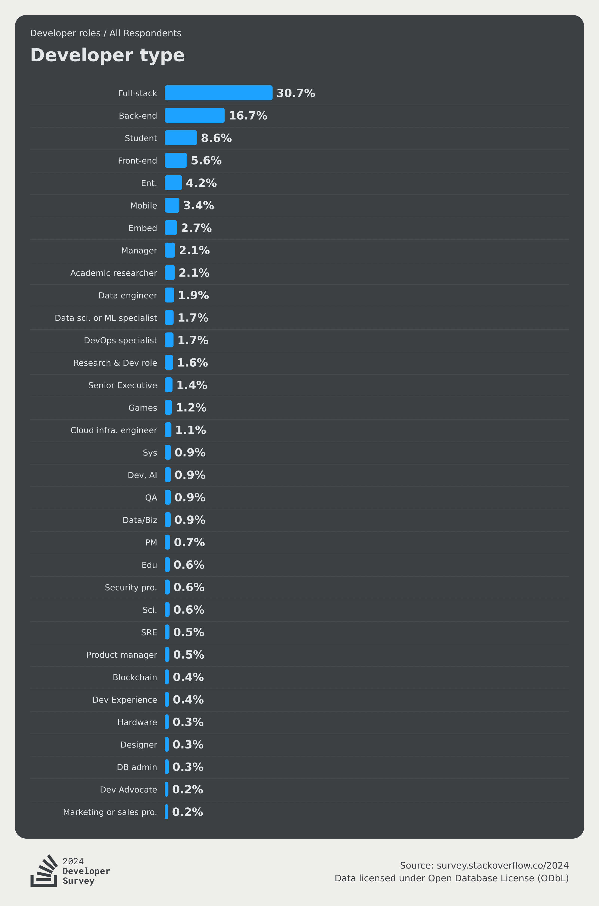
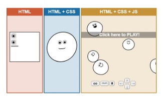
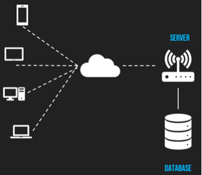

# Introduction to Web Development Space
*Navigating the Deep Dark Space of Web Development*

This workshop covers a brief overview of the most common tools and technologies used in web development.

## This workshop is proudly supported by


## Content
  - [What and Why Web Development?](#what-and-why-web-development)
  - [FAQs about Web Development](#faqs-about-web-development)
  - [Basics of Web and Limitation](#basics-of-web-and-limitation)
  - [Server-side Applications (Backend)](#server-side-applications-backend)
  - [Others](#others)
    - [Languages of the Web (the usual)](#languages-of-the-web-the-usual)
    - [Hosting Stuff](#hosting-stuff)
    - [CSS Frameworks](#css-frameworks)
    - [Developer Tools](#developer-tools)
      - [TypeScript](#typescript)
      - [Testing](#testing)
      - [Continuous Integration / Continuous Deployment](#continuous-integration--continuous-deployment)
      - [Virtualisation and Containerisation](#virtualisation-and-containerisation)
      - [Browsers](#browsers)
      - [Firefox Developer Tools](#firefox-developer-tools)
      - [Package Managers](#package-managers)
      - [Version Control](#version-control)
      - [Linters and Formatters](#linters-and-formatters)
      - [Teamwork](#teamwork)
    - [Roadmaps](#roadmaps)
  - [Word of Encouragement](#word-of-encouragement)

## What and Why Web Development?

### What is web development?
- Static websites (e.g. this workshop website!)
- Web applications (e.g. Youtube)

### Why Web Development ?

- Accessibility and Portability
- Career and In-demand job opportunities
- Huge possibility to combine with other emerging technologies (e.g. IoT, Machine Learning) and industry (e.g. Health, Mining, O&G)

??? info "Career in Web Development"
    Source: [Stack Overflow 2024 Developer Survey](https://survey.stackoverflow.co/2024/developer-profile#developer-roles)

    "over half of Developers are Web Developers"
    


## FAQs about Web Development

### Why code websites, why not use drag and drops like Wordpress, WIX?

<div style="display:flex;justify-content:space-around;flex-wrap:wrap;">
    
    
    
</div>

- Content Management System (CMS)
- Limitations on theme/template used
- Difficult to extend
- Cybersecurity

??? info "More information"
    CMS are one of the application of web development, but there are plenty more such as - internet of things, custom software for a particular industrial application (eg. using Machine Learning)

    CMS are usually limited to the template or plugin that you use. If those plugin don't exist, then it limits your productivity very much (difficulty to extend).

    CMS are usually built to cater for non-technical users. This means that thye become the subject of hackers. Think about a scenario where a hacker was able to find a vulnerability in WordPress, now every other WordPress site will be vulnerable.

### Why does CFC not do mobile development as much as web development?

- App stores have a developer cost
- Easier to deal/teach web technologies
- Accessibility (mobile, sensors, tablets, laptops and PCs)
- Bigger communities
- We sometimes do mobile development! (Kind of)
    - Progressive web apps

### If I already know a frontend framework, is it better to learn another frontend framework or to learn a backend framework?

- It is better to learn a backend framework

??? info "Reasoning"
    You want to build skills that complement one another rather than be an alternative.

    It is much more valuable for you to learn a backend framework because that helps you build a **functional** app.


## Basics of Web and Limitation



=== "HTML"
    **What is it?**

    - Hypertext Markup Language
    - Describes the structure of a web page

    **Limitation**

    - Doesn’t handle repeated content well
    - No variables or calculation


    ???+ example "HTML Syntax"
        ```html
        <!DOCTYPE html>
        <html lang="en">
        <head>
            <meta charset="UTF-8">
            <meta http-equiv="X-UA-Compatible" content="IE=edge">
            <meta name="viewport" content="width=device-width, initial-scale=1.0">
            <title>Document</title>
        </head>
        <body>
            Hello World!
        </body>
        </html>
        ```

=== "CSS"
    **What is it?**

    - Cascading Style Sheets
    - Describes the presentation of a web page

    **Limitation**

    - Most css is quite similar (Handled by CSS Libraries)
    - Not very dynamic (Handled by CSS Frameworks)


    ???+ example "CSS Syntax"
        ```css
        body {
            background-color: #f0f0f0;
            font-family: sans-serif;
        }

        .container{
            width: 80%;
            margin: 0 auto;
        }
        ```

=== "JS"
    **What is it?**

    - JavaScript
    - Used to program complex features on a web page

    **Limitation**

    - Has the capability to modify the user interface, but becomes really tedious to modify interface (more about this in another workshop)

    ???+ example "JS Syntax"
        ```js
        const bodySelector = document.querySelector('body');
        const myFunction = () => {
            bodySelector.innerHTML = 'Hello World 2!';
            // Add a container class to space out
            bodySelector.classList.add('container');
        }
        bodySelector.onclick = myFunction;
        ```


### Modern Frameworks

- Websites can be much more… they can be web applications
- “App” in a website (client-side rendering)

???+ success "Modern Frameworks"
    === "React.js"
        - More mature and used more in industry

        

    === "Vue.js"
        - Growing fast in popularity and use.

        


    **General Information**

    - Both are good to use and learn. 
    - Knowledge is transferable between the two frameworks.

??? info "Comparison between HTML and JSX"
    

    Highlighted portions are starting chunk of distinct code.

    ???+ example "HTML"
        ```html hl_lines="2 15 27 41"
        <div class="row">
            <div class="m-0 col-12 col-md-6 col-lg-3">
                <div class="text-center border-0 bg-transparent card">
                <div class="px-0 card-body">
                    <i class="material-icons-sharp md-lg">devices</i>
                    <p class="mt-4 font-weight-bold text-monospace text-larger">
                    Applications
                    </p>
                    <p class="mb-0">
                    Build custom web and mobile applications to engage with your audience
                    </p>
                </div>
                </div>
            </div>
            <div class="m-0 col-12 col-md-6 col-lg-3">
                <div class="text-center border-0 bg-transparent card">
                <div class="px-0 card-body">
                    <i class="material-icons-sharp md-lg">web</i>
                    <p class="mt-4 font-weight-bold text-monospace text-larger">Websites</p>
                    <p class="mb-0">
                    Build new websites or optimise existing pages to improve online
                    visibility
                    </p>
                </div>
                </div>
            </div>
            <div class="m-0 col-12 col-md-6 col-lg-3">
                <div class="text-center border-0 bg-transparent card">
                <div class="px-0 card-body">
                    <i class="material-icons-sharp md-lg">storage</i>
                    <p class="mt-4 font-weight-bold text-monospace text-larger">
                    Data Storage
                    </p>
                    <p class="mb-0">
                    Design and create databases for efficient information storage and
                    retrieval
                    </p>
                </div>
                </div>
            </div>
            <div class="m-0 col-12 col-md-6 col-lg-3">
                <div class="text-center border-0 bg-transparent card">
                <div class="px-0 card-body">
                    <i class="material-icons-sharp md-lg">how_to_reg</i>
                    <p class="mt-4 font-weight-bold text-monospace text-larger">
                    Consulting
                    </p>
                    <p class="mb-0">
                    Empower your organisation through technical knowledge and advice
                    </p>
                </div>
                </div>
            </div>
        </div>
        ```

    ???+ example "JSX"
        ```js hl_lines="24"
        import { memo } from 'react'
        import { Row, Col, Card, CardBody } from 'reactstrap'
        import services from 'data/services.json'

        const Service = (props: {
        icon: string
        title: string
        description: string
        }) => (
        <Card className='text-center border-0 bg-transparent'>
            <CardBody className='px-0'>
            <i className='material-icons-sharp md-lg'>{props.icon}</i>
            <p className='mt-4 font-weight-bold text-monospace text-larger'>
                {props.title}
            </p>
            <p className='mb-0'>{props.description}</p>
            </CardBody>
        </Card>
        )

        const Services = () => (
        <Row>
            {services.map(service => (
            <Col
                xs={12}
                md={6}
                lg={12 / services.length}
                className='m-0'
                key={service.title}
            >
                <Service {...service} />
            </Col>
            ))}
        </Row>
        )

        export default memo(Services)
        ```

## Server-side Applications (Backend)

<div style="display:flex;justify-content:space-around;flex-wrap:wrap;flex-wrap:wrap;">
    
    
    
    
</div>


### How do devices communicate?

- HTTP Request - Hypertext Transfer Protocol



### What do server applications do?

- Serve frontends (server-side rendering)
- Web API (Application Programming Interface)
    - Serve data (usually from a database)
    - Process Request (Sending emails or SMS, Machine Learning)
 
### Databases
Place to store the data

**Mongodb**

Allows for database design to be modified without complex migration or data loss

**SQL**

Typically faster and better for large amounts of data or systems that need data consistency and reliability

## Others

### Languages of the Web (the usual)
- Python (Django, Flask)
- JavaScript (Node.js, Express)
- Ruby, Go, Rust, C

### Hosting Stuff
Many ways
- Self host/On premise
- 3rd party options
    - shared/dedicated server
    - Serverless
    - AWS ECS/Digital Ocean App Platform

### Frontend Frameworks

**Frontend (JS)**

- Vue, React
- Nuxt.js, Next.js
- Svelte

**Frontend (CSS)**

- MaterialUI, Vuetify
- Bootstrap
- Tailwind

### Developer Tools

#### TypeScript
- Type checking is super useful for complex apps
- Allows for way better javascript developer tooling
- Can be annoying if you’re new at it

#### Testing

- Selenium, Cypress
    - End to end automated testing tools
- Jest, Mocha, Pytest
    - Unit testing
- Testing is vital to software projects

#### Continuous Integration / Continuous Deployment

- Automated Testing
- Event-driven scripts
- E.g. Github Action, Bitbucket Pipelines

#### Virtualisation and Containerisation

- Allows execution of services in a virtual environment
  - eg. Docker (Containerisation), Vagrant (Virtualisation)

#### Browsers

- Standard browsers
    - Google Chrome, Firefox, Edge, etc.
- Backwards compatibility
    - Internet Explorer
- Other
    - Mobile - Responsive
    - Screen readers - Accessibility

#### Firefox Developer Tools
- Page Inspector
    - Visualise page aspects
    - Grid layout
- Web Console
    - `console.log(“Hello World”)`
- Responsive Design Mode
    - View from POV of different screen sizes such as mobile, tablets, etc.

??? info "Some more tools"
    - JavaScript Debugger
    - Network Monitor
    - Performance Tools
    - Rulers
    - Colour Pickers
    Learn more at: https://developer.mozilla.org/en-US/docs/Tools

#### Package Managers
- Installs libraries that can be used
- Also has code shortcuts (e.g. npm run start)

(More about `package.json` and `poetry.toml` in the projects and Package Manager Workshop)

#### Version Control
- Essential for developer teams and complex software development
- Git
    - Hosted options
        - Bitbucket
        - Github
        - Gitlab
- Subversion

#### Linters and Formatters
- Makes code formatting consistent (following standard)
- Useful with version controls to avoid pointless change

eg.ESLint, Prettier

#### Teamwork
- Many tools out there
- Used to stop teams from stepping on each others toes
- Github Issues + Pull Requests

### Roadmaps
There's an open-source community that maintains a learning roadmap for developers. See [https://roadmap.sh/](https://roadmap.sh/)

??? info "Frontend Developer"
    

??? info "Backend Developer"
    

??? info "Dev-Ops"
    
