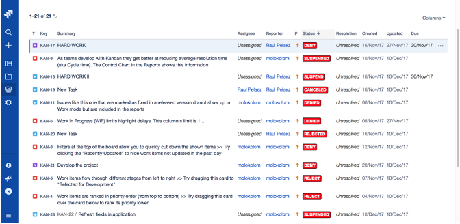

## This workshop is proudly supported by

## How do software engineers work?
- project management system
    - Jira
    - Trello
    - Gitub Issues
- Version control system:
    - Git
        - Github
        - Bitbucket
        - Gitlab
        - Gitea
    - Subversion
    - Email...?

???+ example "Github Issues and Jira"
    The examples are Github Issues and Jira.

    
    

Listing of issues can be displayed in **kanban boards**.

???+ example "Kanban Boards"

    
    

## Why do Software Engineers Work like this?

<iframe width="100%" height="500rem"
src="https://www.youtube.com/embed/oyVksFviJVE" 
frameborder="0" 
allow="accelerometer; autoplay; encrypted-media; gyroscope; picture-in-picture" 
allowfullscreen></iframe>

???+ info "Scrums"
    One example of "agile" ways of working and it looks like this.
    

## What is Git?
<iframe width="100%" height="500rem"
src="https://www.youtube.com/embed/hwP7WQkmECE" 
frameborder="0" 
allow="accelerometer; autoplay; encrypted-media; gyroscope; picture-in-picture" 
allowfullscreen></iframe>

Git is a

- **version control system**
- tools for **coordinating work for different changes**

## Git vs Git providers

### Git

- Version control system
- Acts on code repositories

Basic features of git:

- Repositories
- Commits
- Branches
- Merging

### Github

- Hosts code repositories
- Supporting functionality to assist with development

Basic features of Github:

- Pull requests
- Code reviews
- Comments
- Github Actions
- Permissions

## Git Versioning Strategies

- Trunk based (we will be using this model!)
- Feature based
    - GitFlow
    - Gitlab Flow

??? info "GitFlow"
    {align=left}

## Live demonstration

- [Demo Repository](https://github.com/codersforcauses/software-engineering-practices-demo-2025-winter)

## Other Resources
- [Git and Github](https://www.youtube.com/watch?v=HkdAHXoRtos)
- [Superpowers Of Git](https://webakari-docs.vercel.app/developers/)